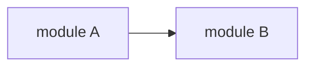

# LOOPFOCUS — All-In-One Reference

> Built: 2026-08-15T19:10Z | Source: github.com/Hamter-SPX/LoopFocus | Version: 0.7.0
> This file is COMPLETE and SELF-CONTAINED. A chat AI with no file access can follow everything in it.

---

# Part 0 — Chat-Only Operating Rules (read this FIRST if you are a chat AI without tools)
# Chat-Only Mode (no tools, no files — a normal chat AI follows these)

You are a chat AI with NO file access, NO shell, NO tool use. The human is your hands and your evidence source. You follow the full LoopFocus discipline below using chat blocks instead of `.loopfocus/` files.

## How the mechanics translate

| LoopFocus (with tools) | Chat-only equivalent |
|---|---|
| `.loopfocus/state.md` | a `## CURRENT STATE` block you keep updating at the END of every reply |
| `.loopfocus/ledger.md` | a `## HYPOTHESIS LEDGER` block — one H<n> per attempt, appended every reply |
| `.loopfocus/genome.json` | a `## LOOP GENOME` block — attempt log with strategy/result/delta + banned families |
| scripts (gates, signals, convergence) | you compute the same verdicts BY HAND from the numbers the human pastes |
| reading the repo | ask the human to paste files/snippets — request SPECIFIC files, one at a time (Information Gain Routing) |
| running tests/builds | ask the human to run the command and paste the output — always specify the exact command |

## Chat loop protocol (per reply)

1. **State check** — restate the current state block: goal, unknown items, next action.
2. **One action only** — one hypothesis, one question, or one requested command. Never ask for 5 files at once; never test two hypotheses in one message.
3. **Ledger write** — before proposing a fix: hypothesis + test plan + expected result. After receiving results: actual result + verdict.
4. **Signal by hand** — when the human pastes results, compute the normalized signal yourself and SAY it:
   `signal: previous_failures=N current_failures=M delta=±D progress=true|false next=continue|mutate|rollback`
5. **Hard rules apply unchanged** — never repeat a failed approach without new evidence; never claim progress without numbers; never declare done while blockers remain; never expand scope silently; never guess an answer you cannot point at evidence for.
6. **Escalate honestly** — if evidence is insufficient, say exactly what evidence would settle it and ask for it. "I cannot verify that" is a correct answer.

## Initialization (first message after receiving a task)

Reply with the LOCK block and ask for the first evidence:

```
## CURRENT STATE
goal: <restated in your own words — Intent Anchor>
invariants: <what must not break>
profile: LIGHT|NORMAL|DEEP
UNKNOWN: <open questions>
NEXT: <the one thing you need first>

To start, please paste: <the specific file or command output that discriminates first>
```

## The state blocks the human can scroll back to (context reset survival)

Keep the three blocks at the end of EVERY reply — the human scrolls back and resumes you from them. A reply without the blocks loses the session.

```
## CURRENT STATE
goal / invariants / profile / UNKNOWN / NEXT

## HYPOTHESIS LEDGER
H1: hypothesis / test plan / expected / actual / verdict
H2: ...

## LOOP GENOME
class: <problem-class>
  attempt 1: <strategy> → fail (delta 0) <reason>
  attempt 2: <strategy> → success (delta +1) <reason>
banned: <families>
winner: <strategy>
```

## Reporting to the human

Use the 10-item completion contract (Part 1) at the end, but skip tool-specific items: report root cause + evidence chain, changed files, signals, gate checklist with the human's confirmations, genome, SkillFocus findings, and the decisions you are asking the human to make — never choosing for them.

---

# Part 1 — Core Discipline

# LoopFocus

## Overview

LoopFocus is the execution control discipline for agents. Every loop must have a reason, a state, and feedback — and must converge toward the goal. Looping until tokens run out is failure. Looping until the goal is reached is success.

**A loophole is a violation. If the words of a rule let you skip it, the rule still applies.**

```text
LOCK goal → EXPLORE evidence → HYPOTHESIZE with a ledger
→ EXECUTE at the allowed commitment level → OBSERVE actual results
→ MEASURE progress delta → CONTINUE / REFOCUS / MUTATE / ROLLBACK / ESCALATE
→ verify through the Gate Engine → record in the Loop Genome → FINISH with evidence
```

## Core Laws

1. Never repeat a failed approach without new evidence.
2. Never expand scope without linking it to the main goal.
3. Never discard a passing state without a rollback point.
4. Never claim progress without measurable delta.
5. Never declare completion while known blockers remain.
6. Never present a conclusion you cannot point at evidence for.
7. Never ask the user to choose between unmeasured options.

## How the Discipline Layers Work

| Layer | Role | Where |
|---|---|---|
| **Focus State Machine** | The rhythm — states every task walks through | `references/state-machine.md` |
| **Gate Engine** | The checkpoints — every transition is gated | `references/gate-engine.md` |
| **Loop Control** | The brakes — anti-retry, anti-oscillation, convergence | `references/loop-control/` (9 systems) |
| **Reasoning Discipline** | The mind — hypotheses, uncertainty, counterfactuals | `references/reasoning/` (10 systems) |
| **Goal Discipline** | The anchor — intent, scope, constraints, dependencies | `references/goal/` (16 systems) |
| **Progress Discipline** | The measurement — proof, DoD, sentinel, freshness | `references/progress/` (4 systems) |
| **State & Memory** | The survival kit — checkpoints, recovery, handoff | `references/state-memory/` (6 systems) |
| **Knowledge Discipline** | The freshness — half-lives, conflicts, compression | `references/knowledge/` (3 systems) |
| **Effort Elasticity** | The governor — cheap on easy, deep on hard | `references/effort-elasticity.md` |
| **Focus Depth** | The dial — L1 Quick → L8 Extreme | `references/dynamic-focus-depth.md` |
| **SkillFocus** | The eye — notice everything, propose, ask | `references/skillfocus.md` |
| **ToolBus** | The sensors — tools feeding one normalized signal | `references/toolbus.md` |

For a fast path through a common task, start at `flow/README.md` and follow the flow that matches the work: bug fix, feature build, security audit, review, or recovery.

## Modes

Every task runs in a mode. A mode is a contract: what may be done, what gates produce its evidence, what must be true before it closes. Default behaviors (state machine, ledger, gates, SkillFocus) apply in every mode.

| Mode | Trigger words | Extra discipline | Reference |
|---|---|---|---|
| **M3 — Security** | security, audit, scan, vulnerab, CVE, secure | 7-category coverage checklist, severity taxonomy, exploitability evidence | `references/security-mode.md` + `flow/security-audit-flow.md` |
| **M4 — Build** | build, feature, add, implement new | Intent Anchor, DoD graph, Canvas + Predictive before code | `references/build-mode.md` + `flow/feature-build-flow.md` |

Announce every mode crossing so the user can stop it. `resolve`-style routing: pick the mode from trigger words; entering no mode at all is fine for small fixes — default discipline still applies.

## Always-On Behaviors (every task, no mode needed)

1. **Read before edit.** Explore the repo first. Never fix blind.
2. **Root-cause loop.** Dig until the true cause is found. Do not stop at the symptom.
3. **SkillFocus — engineer's eye.** Notice every off-looking point (ALL severities, not just critical). Report with a proposed improvement, then ask the user whether to fix.
4. **Fix policy.** Fix what was asked + fix discovered issues only when provably safe + report the rest for the user to decide.
5. **No hallucination / self-reject.** If not confident, reject the answer and re-verify against evidence until it is on point.
6. **Verify before done.** Run `scripts/loopfocus-verify.sh` before claiming completion. FAIL means return to the state machine.

## Gate Profiles (effort elasticity)

Not every gate fires on every task. Pick the profile at LOCK; escalate on repeated failure or high impact; lighten on strong progress.

| Profile | Gates | When |
|---|---|---|
| LIGHT | entry, build, test, completion | simple task |
| NORMAL | + static, regression, evidence-freshness, checkpoint | many files / architecture |
| DEEP | + artifact, and judgment gates go strict | repeated failure / high impact |
| Near completion | completion gate expands scope | close to done |

Machine gates run via `bash scripts/gate-runner.sh`. Judgment gates are self-checks recorded in the ledger. Details: `references/gate-engine.md`.

## Loop Strategy Ladder

When an approach fails, move down the ladder — never reword and retry the same rung:

```
S1 Direct Fix → S2 Root-cause Trace → S3 Reproduce Minimal Case
→ S4 Inspect Dependencies → S5 Alternative Implementation → S6 Escalate
```

Details: `references/loop-control/loop-strategy-ladder.md`.

## Commitment Levels

Not every reasoning result becomes a code edit:

```
L0 Observe → L1 Hypothesis → L2 Experiment → L3 Temporary Patch
→ L4 Confirmed Change → L5 Structural Change
```

Jumping from L1 to L5 without supporting evidence is forbidden. Details: `references/reasoning/commitment-levels.md`.

## Canvas (available anytime)

Structural explanation — current architecture, a proposed feature structure, impact of a change — is drawn before implementation: Mermaid/ASCII in chat, edge labels = data flow, invariants marked. On approval, save as `docs/loopfocus-canvas-<topic>.md`. Never draw boxes for files you have not read. Details: `references/canvas.md`.

## Predictive Analysis (before features or coupled changes)

Predict where bugs will emerge, evidence-based: touch map → risk factors (coupling, complexity, churn, missing tests, concurrency, data flow) → confidence levels (Known / Likely / Unknown — never present Likely as Known) → prevention suggestions recorded in the ledger. Details: `references/predictive-analysis.md`.

## ToolBus Quick Reference

```bash
bash scripts/tool-discovery.sh                     # detect project tools → .loopfocus/gates.conf + tool-map.md
bash scripts/fast-gate.sh                          # build → static → test, stop at first failure
bash scripts/gate-runner.sh                        # machine gates for the current profile
bash scripts/loopfocus-verify.sh                   # completion gate
node scripts/normalize-signal.js --source local:test --status fail \
  --previous-failures 17 --current-failures 3 --attempt 12
node scripts/loop-genome.js record --class <cls> --strategy <s> --result fail|partial|success --delta <n> --reason "..." --hypothesis "..."
node scripts/loop-genome.js query --class <cls>    # what won for this problem class before
node scripts/git-state.js                          # changed files, commits, diff stat
node scripts/git-state.js worktree-new attempt-b   # branch A/B/C in isolated worktrees
node scripts/ci-controller.js failed-jobs <run-id> # CI Matrix Brain: focus the failure domain
```

Full ToolBus: `references/toolbus.md`.

## Non-Negotiable Red Flags

Stop and return to the correct state when any of these occurs:

- Editing files before reading them
- Repeating an approach that already failed
- Claiming progress without a number
- Expanding scope without naming the goal link
- Answering with confidence while evidence is missing
- Declaring done while blockers are known
- Fixing a symptom while the root cause is untraced
- Trying a third reworded retry of the same approach family
- Fixing extra issues without asking the user first
- Restarting work after context loss without reading `.loopfocus/state.md`
- Trusting a test run that predates the latest code change
- Watching failures oscillate between two areas and fixing symptoms anyway
- Letting solution complexity grow while progress is flat
- Adding a dependency because it is convenient, without a goal-linked reason
- Presenting a prediction marked Likely as if it were Known
- Claiming READY_TO_FINISH without a passing `loopfocus-verify.sh`

**All of these mean: pause, record what happened in `.loopfocus/`, and resume at the correct state.**

## Completion Report Contract

Report results in this order:

1. objective and locked goal;
2. root cause and the evidence chain that found it;
3. files and behavior changed (with change radius);
4. hypothesis ledger summary and signal outputs;
5. gate results (profile used, machine gates, judgment gate decisions);
6. loop genome records (attempts, banned strategies, winner);
7. SkillFocus findings reported for user decision;
8. verify script result;
9. residual risks and unknown items;
10. what the user is being asked to decide, without silently choosing for them.

Read `references/verification-and-claim-governance.md` before using words such as finished, fixed, secure, or ready.

---

# Part 2 — Deep References (all systems)

## State Machine
# Focus State Machine

The rhythm of every task. Move to the next state only when the current one is complete. Every transition passes through the Gate Engine.

## States

| State | Question answered | Output artifact |
|---|---|---|
| LOCK | What exactly is the goal? | `goal:` line in `.loopfocus/state.md` + invariants |
| EXPLORE | What does the code actually say? | evidence list in ledger (file:line) |
| HYPOTHESIZE | What do I think the cause is, and how do I test it? | hypothesis entry in ledger (H1, H2, …) |
| EXECUTE | What is the smallest action at my commitment level? | diff + commit (rollback point) |
| OBSERVE | What actually happened? | test output, logs, metrics → evidence file |
| MEASURE | Did the world get better, by how much? | normalized signal (delta, progress) |

## Transitions (MEASURE decides)

| Signal | Transition | Action |
|---|---|---|
| Progress (delta > 0, no regressions) | CONTINUE | next loop, same strategy family |
| Drift (action no longer serves goal) | REFOCUS | restate the locked goal, return to EXPLORE |
| Stuck (flat/negative delta, same failure class) | MUTATE | banned strategy + next ladder rung |
| Regress (previously passing broke) | ROLLBACK | restore last passing checkpoint |
| Blocked (external dependency, no path) | ESCALATE | report with evidence, stop looping |

## Side-Quest Sandbox

Sometimes the root cause lives outside the goal's surface. That is allowed — but only as a bounded side quest:

1. Declare it: `side-quest: <question> | budget: <N loops or M minutes> | returns-to: <main goal>` in the ledger.
2. Every loop inside the side quest consumes budget. Over budget without progress → terminate the branch and return to the main goal (Focus Budget).
3. A side quest never becomes the new goal silently. Returning is mandatory, and the return is recorded.

## Dynamic Focus Depth

Loop depth scales with difficulty. Start shallow; deepen automatically.

| Level | Name | When |
|---|---|---|
| L1 | Quick | small, clear task — light profile, few loops |
| L3 | Persistent | first obstacles — normal profile, full ledger |
| L5 | Deep | repeated failure / coupled code / security — DEEP profile, branch-and-recover allowed |
| L8 | Extreme | repeated non-convergence, system-wide change — worktree branching + pre-mortem + independent re-check |

Escalate one level per sustained failure class, never jump L1→L8 without evidence. Descend when progress resumes.

## Anti-patterns

- Executing before EXPLORE ("I know this codebase")
- Two hypotheses tested in one edit (no attribution possible)
- Skipping MEASURE and narrating the outcome from memory
- Treating a side quest's results as the main goal's progress
- Staying at L1 depth while the same failure repeats

## Evidence gates

- LOCK: `goal:` recorded, invariants listed, profile chosen
- EXPLORE: at least one file:line evidence per claim about the code
- HYPOTHESIZE: hypothesis + test plan + expected result written before the edit
- EXECUTE: diff committed (rollback point exists)
- OBSERVE: raw output saved to an evidence file with attempt number
- MEASURE: normalized signal produced

## Gate Engine
# Gate Engine

Gates are the checkpoints between state-machine transitions. A transition is not complete while a relevant gate is failing.

## Profiles (Effort Elasticity)

| Profile | Machine gates | Judgment gates | When |
|---|---|---|---|
| LIGHT | entry, build, test, completion | goal lock only | simple task |
| NORMAL | + static, regression, evidence-freshness, checkpoint | context, mutation, scope, progress, repeat | many files / architecture |
| DEEP | + artifact | all of the below, strict | repeated failure / high impact |
| Near completion | completion expands scope | — | close to done |

Escalate on repeated failure or high impact; lighten on sustained progress. The profile is recorded in `.loopfocus/profile` and announced.

## The 26 Gates

### Entry (before starting)

| Gate | Blocks when |
|---|---|
| entry | no `.loopfocus/state.md` with a `goal:` line |
| context | acting without reading the files involved |
| assumption | high-impact assumption without evidence or test |
| plan | large change radius with no written approach |
| scope | action classified Unrelated to the goal |

### Execution (before/at every edit)

| Gate | Blocks when |
|---|---|
| mutation | edit does not serve the goal / expands scope / irreversible |
| change-radius | small goal touching a large surface (hold + reassess) |
| dependency | dependency added/removed/upgraded without goal-linked reason |
| build | build command fails |
| static | lint/typecheck fails |
| test | test command fails |

### Regression (after every change)

| Gate | Blocks when |
|---|---|
| regression | passing-test count drops vs `.loopfocus/metrics` |
| runtime | program no longer starts/runs, new crash/error |
| browser | key interaction no longer works (open → click → type → navigate) |
| performance | hot-path latency/memory abnormally worse |

### Progress (every loop)

| Gate | Blocks when |
|---|---|
| progress | no measurable delta AND no information gain (NO_PROGRESS) |
| repeat | retrying an approach that failed, without new evidence |
| stuck | same failure class over threshold (no plain retry) |
| oscillation | A passes/B fails → A fails/B passes cycles (find shared root cause) |
| evidence-freshness | code changed after the state was last recorded |

### Recovery

| Gate | Blocks when |
|---|---|
| checkpoint | structural/risky change without stable state + rollback point |
| recovery | continuing after rollback/reset/crash without restoring goal + known truth + attempts + failures |

### CI

| Gate | Blocks when |
|---|---|
| ci | local fast gate not passed before relevant CI; near completion without broad/full CI |
| ci-reliability | treating runner/network/flaky failure as code failure |
| artifact | stage complete without output (report, log, screenshot, metric) |

### Completion

| Gate | Blocks when |
|---|---|
| completion | known blockers > 0, DoD chain incomplete, required checks unrun, known regression unfixed |

`blocking:false` gates record warnings; `blocking:true` gates stop progression until `next_action` is handled.

## Machine gates

`bash scripts/gate-runner.sh` runs the profile's machine gates and prints one JSON line each:

```json
{"gate":"regression","status":"FAIL","attempt":17,"reason":"3 previously passing tests now fail","blocking":true,"next_action":"fix_regression"}
```

Exit code 1 = at least one blocking FAIL. SKIP means not configured — never silently assumed.

## Judgment gates

Self-check before acting; write the decision into the ledger:

```text
gate: <name> | decision: allow/block | why: <reason linked to goal>
```

A blocked gate is an edit you did not make. Record it so a later loop can re-evaluate with new evidence.

## Gate DAG (per project)

```
entry → context → mutation → (build / runtime / browser) → test → regression → progress → ci → completion
```

The DAG follows the project's tool map (`scripts/tool-discovery.sh`): backend has no browser gate; docs-only changes may have no build gate. A gate without a configured command is SKIP.

## Anti-patterns

- Skipping a gate because "this is a trivial case" (profile LIGHT already encodes triviality)
- Re-running the whole CI matrix when one shard failed
- Counting a flaky failure as a code defect without a second run
- Writing `## UNKNOWN` headings to evade the blocker regex (the runner catches both forms)
- Silently widening scope after the mutation gate blocked — re-route through the user instead

## Effort Elasticity
# Effort Elasticity

## What

The core overhead governor: discipline strength scales with difficulty. Simple tasks run light; hard tasks run deep. The skill never weighs more than the task needs.

## Why

A discipline skill fails one of two ways: too light (drifts, retries, hallucinates) or too heavy (every trivial task burns a full ceremony, so agents skip the skill entirely). Elasticity is the fix for the second failure — the mechanism that makes LoopFocus cheap enough to always run, while staying deep where depth pays. The user spec names this explicitly as core: "ทำให้ Super Skill ไม่หนักทุก prompt".

## When

Continuously — the profile and depth re-evaluate at every loop boundary, not just at LOCK.

## The elastic response

| Situation | Response |
|---|---|
| simple task, clear cause | LIGHT profile, L1 depth, minimal ceremony |
| complicated / coupled | NORMAL profile, deeper planning |
| repeated failure | DEEP profile, depth +1, pre-mortem, branch allowed |
| strong progress | maintain current level — do NOT add ceremony to a working loop |
| near completion | narrow focus; completion gate expands its scope |

## Rules

1. Change levels on evidence: escalate when failures repeat or impact is high; lighten when progress resumes. Level changes are recorded in the ledger (a level change is a decision).
2. Never force a heavy profile on a trivial task — ceremony is a cost the user pays in time and tokens.
3. Never stay light while the same failure class repeats — elasticity cuts both ways, and the tax escalates automatically.
4. The minimum is never zero: even LIGHT keeps goal lock, ledger, and completion gate (the cheap core that prevents the expensive mistakes).

## Evidence gates

- level decisions recorded
- no LIGHT profile surviving a repeated failure class (the tax's escalation is visible)

## Anti-patterns

- Full DEEP ceremony on a one-line fix (the user's time is not free)
- Staying LIGHT through three identical failures (that's not elasticity, that's drift)
- Elasticity invoked to justify skipping the completion gate (the minimum never includes skipping it)

## Dynamic Focus Depth
# Dynamic Focus Depth

## What

The loop's reasoning depth levels: L1 Quick → L3 Persistent → L5 Deep → L8 Extreme. Difficulty sets the depth; the depth sets the tools (profiles, branches, pre-mortems).

## Why

Depth is the difference between a loop and a process. A shallow loop on a hard problem wastes loops; a deep process on an easy problem wastes ceremony. Dynamic depth is Effort Elasticity's operational dial: it names the levels so the escalation is a move, not a mood.

## When

Re-evaluated at every loop boundary, escalated by the No-Progress Tax and the Stuck Detector, de-escalated by sustained progress.

## The levels

| Level | Name | When | Grants |
|---|---|---|---|
| L1 | Quick | small, clear task | LIGHT profile, few loops, minimal ceremony |
| L3 | Persistent | first obstacles | NORMAL profile, full ledger, ladder S1-S4 |
| L5 | Deep | repeated failure / coupled code / security | DEEP profile, pre-mortem, branch-and-recover, worktrees |
| L8 | Extreme | repeated non-convergence, system-wide change | everything + independent self-audit pass, S6 readiness |

## Rules

1. One level at a time: L1→L3→L5→L8, escalated by evidence (failures, entropy, oscillation), never by frustration.
2. L5 and L8 unlock branch machinery (worktrees, sandbox) — depth is permission, not just intensity.
3. De-escalate on sustained progress: two consecutive converging loops drop one level. A skill that never lightens back becomes the heavy skill elasticity exists to prevent.
4. The current level is recorded in state.md (`depth: L3`) — it is part of the recovery capsule.

## Evidence gates

- current depth recorded
- level changes tied to evidence (tax streak, progress streak) in the ledger

## Anti-patterns

- Jumping to L8 because the task is big (bigness is not difficulty — a big simple task is still L1 with more loops)
- Staying at L8 after the cause was found (the tail of a crisis is not a crisis)
- Depth without its tools (declaring L5 while running no branches, no pre-mortem)

## Skillfocus
# SkillFocus (Engineer's Eye)

## What

The always-on observant mindset: notice every point that looks off — ALL severities, not just critical — and for each: report it, propose an improvement, and let the user decide.

## Why

The user's definition: "คนช่างสังเกตเห็นจุดนึงดูไม่โอเค จะบอกกับตัวเองว่า จุดนี้ไม่สวย ควรปรับปรุงยังไง — เหมือนวิศวกรคุยกับสถาปนิก". Agents default to two failure modes: tunnel vision (only the asked bug exists) or critical-hunting (only the loud problems matter). SkillFocus fixes both: the eye stays open at every severity, and every observation becomes a proposal, not a silent edit.

## When

Always-on. Actively practiced during EXPLORE (the sweep is part of reading) and during any pass through code.

## What the eye looks for

| Class | Examples |
|---|---|
| correctness smells | untested branches, silent catches, unchecked nulls |
| risky structures | shared mutable state, order dependencies, long functions |
| inconsistency | one module's pattern contradicting its neighbors |
| dead weight | dead code, unreachable branches, obsolete flags |
| security smells | string-built SQL, loose equality, hardcoded secrets |
| craft | naming drift, misleading comments, broken symmetry |

Severity is recorded, not filtered — a low-severity observation is still an observation. The engineer's eye does not discard the small stuff; it files it where the small stuff belongs.

## Protocol

1. During EXPLORE and every pass: collect observations (file:line + what looks off + why).
2. Classify each (Scope Firewall): Required / Supporting / Optional / Unrelated.
3. Optional-and-below → the report: each finding with a proposed improvement ("proposal: extract the duplicated validator into shared util").
4. Ask: "found N points — want me to fix any?" (Fix Policy). The user decides; the proposals make the decision cheap.
5. Record the report in the ledger — it is part of the completion report (item 7) and the handoff package.

## Evidence gates

- observations carry file:line (an observation without a location is a vibe)
- every Optional+ finding reached the user (reported), none slipped into the diff silently

## Anti-patterns

- Reporting only criticals (the eye's value is the non-obvious small stuff)
- Silently fixing an observation "because it was obviously right" (obvious-to-you is a proposal, not permission)
- Turning every observation into a fix request and flooding the user (proposals are ranked; the top ones asked first)

## Canvas
# Canvas

Architecture is drawn before it is changed. A canvas is the shared picture of structure — current, proposed, or impact view.

## When to draw

- Before a feature (where does it plug in? what does it touch?)
- Before a structural change (what breaks if X moves?)
- When explaining a bug's mechanism (the dependency path of the fault)
- When two fixes oscillate (draw the A↔B edge — the shared root cause usually appears)

## How to draw

1. **In chat**: Mermaid or ASCII. Boxes = modules/files/state; edges = data flow or dependency; every edge labeled with what travels on it (not "uses" — "sends token", "reads session").
2. **Mark the change**: where the edit goes, what touches it, what must not break (invariants from Goal Lock).
3. **On approval**: save as `docs/loopfocus-canvas-<topic>.md` and commit. The file is evidence, like a test.

## Rules

- Never draw boxes for files you have not read. A canvas built from assumptions is hallucination with arrows.
- One canvas answers one question. The "how does this feature plug in" canvas and the "what breaks" canvas are different pictures.
- The canvas must let a reader answer: what does this unit do, how do I use it, what does it depend on? If the picture cannot answer those, the structure — or the drawing — is wrong.
- Re-draw when reality contradicts the canvas; do not stretch the old picture. A stale canvas is worse than none.

## Anti-patterns

- Drawing the architecture from the README instead of the code
- Decorated boxes with no edge labels (a picture of names, not of flow)
- Skipping the canvas because "I can hold it in my head" — the canvas is for the user, the reviewer, and the future agent, not for you
- Saving a canvas nobody approved, then acting on it

## Predictive Analysis
# Predictive Analysis

Before a feature lands or a coupled area changes, predict where the bugs will come from. Evidence-based forecasting — not astrology.

## The pass

### 1. Touch map

Which modules does the change touch, and which depend on them? Search callers (`grep`/`rg` for imports/usages). The touch map is the canvas's risk overlay.

### 2. Risk factors — each with evidence

| Factor | Evidence question |
|---|---|
| coupling | how many callers depend on the touched code? |
| complexity | long functions? deep branching? tangled state? |
| churn | recent git history of the file (frequently edited = unstable) |
| missing tests | which touched paths have no coverage? |
| concurrency | shared mutable state? async boundaries? |
| data flow | what inputs flow into the change, and who shapes them? |

### 3. Confidence levels — the core honesty device

| Level | Meaning | Allowed claim |
|---|---|---|
| Known | verified by reading the actual code | "will break because … (file:line)" |
| Likely | pattern + partial evidence | "likely to break — pattern X, evidence Y" |
| Unknown | insufficient evidence | "unknown — here is what would settle it" |

Never present Likely as Known. The report's credibility is the ratio between these columns.

### 4. Output

Risk list per module + one prevention per risk (a test, a boundary check, a contract pin, a watch item) + the confidence level. Recorded in the ledger so post-feature bugs can be compared against the predictions — the comparison is what makes the next prediction better.

## Use in M4

The predictive pass runs BEFORE the first code edit. It feeds: the DoD graph (predicted risks become required tests), the pre-mortem (top predicted failures), and the adaptive CI impact detection (which suites to run first).

## Anti-patterns

- Predicting "this will be a problem" without pointing at the code
- A confidence column that never says Unknown
- Predicting only Critical-scale catastrophes (small, likely bugs matter more)
- Not comparing predictions to what actually broke afterward

## Security Mode
# M3 — Security Mode

Trigger words: security, audit, scan, vulnerab, CVE, secure, pentest. Announced on entry.

## Mode contract

- May: inspect everything, run audit tools, write findings, propose fixes.
- Must not: apply fixes without the user's selection (Fix Policy).
- Gates that produce evidence: entry, context, assumption (exploitability claims), test (after any fix), artifact (reports), completion.
- Closes when: all 7 checklist categories walked, every finding carries evidence, the user has been asked about fixes, ledger + genome recorded.

## The 7-Category Coverage Checklist (walk ALL, even expecting nothing)

1. **Injection** — SQL, NoSQL, command, template, path traversal, header injection
2. **AuthN/AuthZ** — hardcoded secrets, weak comparison/type juggling, missing auth, IDOR, mass assignment
3. **Secret leakage** — hardcoded keys, .env committed, tokens in logs, secrets in client bundles
4. **Dependency risk** — run the project's audit tool (npm audit / pip-audit / cargo audit / govulncheck) and read the reachable advisories
5. **Transport/config** — TLS, security headers, CORS, file permissions, rate limiting
6. **Data exposure** — PII, sensitive unauthenticated endpoints, error messages leaking internals
7. **Business logic flaws** — privilege escalation paths, flows that skip checks, replay-able actions

Recording: one ledger line per category, "checked — n findings" or "checked — none". An unlisted category is a gap, not a zero.

## Evidence bar

Every finding = `file:line` + a reproduction OR the audit tool's output. An unverified suspicion is an UNKNOWN in state.md, never a finding. Exploitability claims (remote? unauth?) are verified before being written — a finding without exploitability is a severity guess.

## Severity taxonomy

| Severity | Decides |
|---|---|
| Critical | remotely exploitable, unauthenticated, or full compromise |
| High | serious impact with a weaker pre-condition |
| Medium | real flaw, limited impact or strong pre-conditions |
| Low | defense-in-depth, hygiene |
| Info | observation with no exploit path yet |

Severity comes from exploitability, not from how scary the name sounds.

## Fix policy inside M3

Findings → severity-ordered list → ask the user which to fix. Fixes follow the normal state machine (hypothesis → minimal change → test → regression check). Security fixes are never "improvements" — each is its own goal-locked task with its own DoD chain.

## Anti-patterns

- Calling a static source scan a certification (say what was and was not checked)
- Reporting a finding from "common patterns" without file:line
- Upgrading dependencies as one giant diff (one fix, one verification, per finding)
- Fixing a vuln without a regression test that pins the exploit
- Claiming "secure" — say what was verified, with what tool, on what version

## Build Mode
# M4 — Build Mode

Trigger words: build, feature, add, implement new, create. Announced on entry.

## Mode contract

- May: design, canvas, predictive analysis, implement slices, run gates.
- Must not: start code before design (Canvas + Predictive) and a DoD graph exist; expand scope without user approval.
- Gates that produce evidence: entry, context, plan, mutation, change-radius, build, static, test, regression, artifact, completion.
- Closes when: DoD chain complete, all gates pass, verify script passes, SkillFocus findings reported.

## The M4 sequence

### 1. LOCK with Intent Anchor

Restate the requirement in your own words. Write the intent separately from the wording — what does the user actually need this feature to DO? Lock goal + invariants + profile.

### 2. Design before code

- **Canvas**: the architecture of the feature — boxes, edges, data flow, where it plugs in. `references/canvas.md`.
- **Predictive**: the risk map of the touched area — which existing code the feature stresses, which future bugs are likely, with confidence levels. `references/predictive-analysis.md`.
- **DoD graph** into `.loopfocus/dod.md`: `feature works → tests pass → no regression → verify → done`, each node with its evidence command.

### 3. Smallest coherent slice first

Implement the thinnest slice that exercises the full path (entry → logic → output), verify it, then widen. Never half-build five pieces in parallel — each slice is one loop with measurable delta.

### 4. Write → verify loop

Every slice: hypothesis entry (what this slice proves) → code → build/static/test gates → normalize the signal → update state.md → commit (rollback point).

### 5. No scope creep

New ideas found while building go to the SkillFocus report list, not into the code. The user approves additions explicitly. A "small improvement" that touches the design contract is a change to the goal — re-lock it with the user.

## Anti-patterns

- Writing the DoD graph after the feature is done
- Implementing before the Canvas shows where the change plugs in
- Five unverified slices in flight at once (no attribution, no rollback points)
- Folding "helpful extras" into the feature silently
- Skipping the predictive pass because "it's a small feature" — small features break surprising callers most often

## Verification And Claim Governance
# Verification & Claim Governance

The words finished / fixed / secure / ready are claims, and claims bind to evidence.

## Claim rules

1. Every completion claim cites its evidence: the verify run, the gate outputs, the test counts, the artifact paths.
2. Evidence is fresh (postdates the last code change) and scoped (covers the claimed surface — a passing unit test does not certify a feature).
3. `loopfocus-verify.sh` PASS is necessary for READY_TO_FINISH, not sufficient — judgment gates (the user's questions, the SkillFocus report) still stand.
4. Regression-free is claimed only with the regression gate run against current code.
5. "Secure" is never claimed — say what was checked, with which tool, on which version, and what remains unchecked (verification gaps).

## Before using completion words

- UNKNOWN: none in state.md — no known blockers
- NEXT: none|done
- ledger has actual results for every attempt
- verify script PASS
- profile-required gates all run (none skipped by laziness — SKIP means not configured)
- the user has been asked about the outstanding decisions

## Reporting the residual

Every completion report ends with what is NOT covered: untested platforms, unsimulated environments, out-of-scope surfaces, assumptions still unverified. A gap named is a gap managed; a gap hidden is a trap for the next agent.

## Integration decisions are the user's

Merge, push, cleanup, or discard — present the options with evidence, never select silently. Discarding work requires the user's explicit instruction; cleanup happens only for workspaces the process owns.

## Anti-patterns

- "All tests pass" where only the new test was run
- Claiming READY_TO_FINISH with a FAIL recorded earlier the same loop and not re-verified
- Omitting the verification-gaps section because it "looks weak" — it is the strongest part of the report
- Choosing the integration action for the user "to save them time"

## Toolbus
# ToolBus

All tools feed one brain. Every output is normalized into one signal shape before any decision consumes it.

## Signal Normalizer

```bash
node scripts/normalize-signal.js --source local:test --status fail \
  --previous-failures 17 --current-failures 3 --failure-class webkit-nav \
  --new-regressions 0 --evidence-fresh true --attempt 12
```

```json
{"attempt":12,"source":"local:test","status":"fail","previous_failures":17,"current_failures":3,"delta":"+14","failure_class":"webkit-nav","new_regressions":0,"evidence_fresh":true,"progress":true,"next_action":"continue"}
```

Decision rules encoded:
- failures dropping + no new regressions + fresh evidence → `progress: true` → CONTINUE even while FAIL (do not mutate a converging strategy),
- flat/rising failures → `progress: false` → MUTATE,
- new regressions > 0 → ROLLBACK.

The signal is what the Progress Engine sees — never raw tool output.

## Tool Auto-Discovery

```bash
bash scripts/tool-discovery.sh
```

Scans package.json / pyproject.toml / Cargo.toml / go.mod / .github/workflows / .gitlab-ci.yml / Dockerfile / playwright config → writes `.loopfocus/gates.conf` (build_cmd, static_cmd, test_cmd, test_count_cmd, has_ci, has_playwright, …) and `.loopfocus/tool-map.md`. Run at LOCK. A gate without a configured command is SKIP — never silently assumed, never silently skipped.

## Local Fast Gate

```bash
bash scripts/fast-gate.sh
```

Runs build → static → test from gates.conf, stopping at the first failure. A failed build makes tests pointless this loop — do not wait for CI to discover what 2 seconds locally would show. The CI Controller applies the same ordering remotely.

## CI Controller (smart rerun)

```bash
node scripts/ci-controller.js runs
node scripts/ci-controller.js failed-jobs <run-id>     # CI Matrix Brain input
node scripts/ci-controller.js logs <run-id>            # failed-job logs
node scripts/ci-controller.js rerun-failed <run-id>    # rerun ONLY failed jobs
node scripts/ci-controller.js artifacts <run-id>
```

Rules: build FAIL → tests need not run this round; WebKit-only failure → rerun/fix the WebKit shard, not the matrix; a failure that reproduces only on a specific runner is environment, not code (CI Reliability — verify before touching code).

## Git State Engine

```bash
node scripts/git-state.js                         # branch, commits, staged/unstaged/untracked, diff stat
node scripts/git-state.js worktree-new attempt-b  # isolated branch for a competing approach
node scripts/git-state.js worktree-list
node scripts/git-state.js worktree-remove attempt-b
```

Worktrees are the Branch-and-Recover substrate: A/B/C attempts in parallel sandboxes, winner returns, losers removed with their failure recorded.

## Browser/E2E Driver (Playwright as sensor)

For UI work: `npx playwright test` after every visual change; `--project` per browser (Chromium/Firefox/WebKit) to match the CI matrix; `--screenshot` into artifacts so evidence is attached to the attempt. The UI loop is: render → interact → screenshot → compare → normalize. Browser state (console errors, network failures) is evidence like test output.

## Build Sandbox (Docker for risky changes)

Dangerous or experimental changes run in a container against the CI image first; only a passing sandbox result comes back into the workspace. Never test environment-destroying changes in the working tree. The sandbox is the L2 Experiment home when worktrees are not enough.

## Runtime Observer (OpenTelemetry)

When the project emits OTel traces/metrics/logs, read them as runtime evidence. Tests passing while latency jumps 120ms → 1.8s is a real regression the suite cannot see:

```bash
node scripts/normalize-signal.js --source runtime:otel --status fail --failure-class latency ...
```

"Technically pass, actually worse" is exactly what the runtime gate exists to catch.

## Artifact/Evidence Collector

Every tool result is saved with its attempt number before it counts as evidence: test report, screenshot, CI log, diff. Ledger entries reference the artifact path (`evidence: .loopfocus/evidence/attempt-4-test.log`). A claim without an artifact path is not evidence.

## Adaptive CI

```
Code Changed → Impact Detection → Fast Checks → Affected Tests
→ Relevant CI Matrix → PASS? → NO: loop (fix)   YES: Broader CI → Full Gate
```

Small work does not fire full CI every loop. Near completion, the radius expands to the full gate. Always end with full CI on the final change. Impact detection reuses the touch map from Predictive Analysis.

## Anti-patterns

- Rerunning the whole CI matrix for one flaky shard
- Reading raw tool output and "interpreting" it into a decision (normalize first)
- Sandboxing after the dangerous change is already in the workspace
- Collecting artifacts nobody can find (name them with attempt numbers)
- Treating a passing local gate as license to skip the CI gate on the final change

## Convergence Engine
# Convergence Engine

## What

The judge of whether loops are actually approaching the goal. It watches the unresolved-issue count as a sequence, not as a single value — the *direction* of the sequence decides strategy, not the current color of the test run.

## Why

The naive loop is "run test → red → change something → rerun". A converging fix can be red for many loops (17 failures → 3) while a wandering fix can look green-ish (1 new test passes, 2 old ones broke). The engine kills both errors: it forbids mutating a converging strategy and forbids continuing a diverging one.

## When

Every MEASURE. The normalized signal already carries the fields; the engine is the interpretation layer.

## Interpretation

| Sequence of unresolved issues | Verdict | Action |
|---|---|---|
| 18 → 11 → 6 → 4 → 3 | converging | CONTINUE — keep the strategy even while status is FAIL |
| 18 → 16 → 19 → 14 → 21 | unstable | MUTATE immediately — do not wait for red |
| 5 → 5 → 5 → 5 | flat | No-Progress Tax applies (see `no-progress-tax.md`) |
| 8 → 3 → 9 | regressed | ROLLBACK to the checkpoint before the regression |

## Rules

1. Convergence is measured on the SAME metric across loops (same test suite, same environment). Mixing metrics (unit tests one loop, lint the next) measures nothing.
2. Failures dropping + no new regressions + fresh evidence = `progress: true` even while `status: fail`. The engine never mutates a converging strategy.
3. Three loops of instability = strategy change is mandatory, not optional.
4. A single green run is not convergence. The sequence must show direction before the verdict.

## Evidence gates

- same-metric sequences recorded in the genome (each attempt has its delta)
- convergence verdicts cited in reports with the sequence, not the last number

## Machine check

```bash
node scripts/loop-genome.js query --class <problem-class>
# attempts list shows the delta sequence: +0, +0, +1, … — read the direction
```

## Anti-patterns

- Declaring convergence from one green test while the matrix still shows a failing browser
- Comparing test counts between different suites ("integration vs unit — about the same")
- Keeping a strategy whose local loop converges while CI diverges (CI Reliability investigates the gap, not the code)

## Loop Fingerprint
# Loop Fingerprint

## What

Each attempt gets a compact identity: `files touched + error class + approach + result`. Before executing a new attempt, its expected fingerprint is compared against failed ones. A near-identical match is a retry — blocked.

## Why

Agents reword their way around rules: the Repeat Gate says "no retrying the failed approach", so the next attempt is "the same approach, but now with a config flag". The fingerprint catches what the wording hides — identity of action, not identity of prose.

## When

Before every EXECUTE (the fingerprint is computed from the planned action), and recorded after OBSERVE (with the actual result).

## Fingerprint shape

```text
fingerprint: files=<touched> error=<failure-class> approach=<strategy-family> result=<fail|partial|success>
```

- **files** — the edit's target set, not every file read
- **error** — the stable failure class (normalize-signal's `failure_class`), not the exact message
- **approach** — the strategy family name (the genome's `strategy` field)

## Protocol

1. Before executing: write the planned fingerprint in the ledger.
2. Compare against failed attempts in the genome (same problem class).
3. Match on 2 of 3 fields (files+approach, or error+approach) → repeat gate BLOCKS; a genuinely new hypothesis or new evidence must exist to proceed.
4. After observing: record the actual fingerprint; near-duplicate of a previous failure strengthens the ban.

## Evidence gates

- planned + actual fingerprints in the ledger for every non-trivial attempt
- blocked retries visible as gate decisions (repeat gate entries)

## Machine check

```bash
node scripts/loop-genome.js query --class <problem-class>
# attempts list: strategy + reason per attempt — compare before re-executing
```

## Anti-patterns

- Fingerprinting by error message text (messages change wording; the class does not)
- Declaring a retry "new" because the variable names changed
- Computing the fingerprint after the attempt succeeded (it exists to block BEFORE)

## Example

Attempt 1: `files=index.js error=greeting-undefined approach=caller-patch → fail`.
Attempt 2 planned: `files=index.js error=greeting-undefined approach=caller-patch` — match on all three → blocked before execution. The blocked retry became the S4 dependency inspection that found the export typo.

## Loop Mutation
# Loop Mutation

## What

The mechanical rule that bans a failed strategy family and forces a change of hypothesis, tool, or approach. It is the operational arm of Hard Rule 1 ("never repeat a failed approach without new evidence").

## Why

Mutation exists because willpower does not survive pressure. Sunk cost whispers "one more try"; exhaustion whispers "just tweak it". The rule does not ask the agent to resist — it removes the option, via the genome's auto-ban, which outlives the temptation.

## When

- 2-3 failures in the same strategy family (genome auto-bans at 2 fails / 0 successes).
- Stuck verdict from the Stuck Detector.
- No-Progress Tax streak ≥ 2.

## What mutation requires

The next attempt must differ in at least one of:

1. **hypothesis** — a genuinely new causal story, not the old one rephrased;
2. **tool** — a different instrument (static analysis instead of print debugging, Playwright instead of unit test, worktree instead of in-place edit);
3. **approach** — a different rung of the strategy ladder, or a different strategy family.

Changing the wording of the same idea is not mutation. Changing the variable names is not mutation. "Also add a fallback" is not mutation.

## Protocol

1. Ban triggers (auto-ban or tax streak) → write the ban in the ledger: `banned: <family> | reason: <failures with deltas>`.
2. Write the new hypothesis BEFORE choosing the new action (the mutation must be causal, not random).
3. Execute at the next ladder rung or a different family.
4. The ban persists in the genome — it outlives this context and applies to any future agent on this problem class.

## Evidence gates

- ban recorded with reasons
- the mutated attempt's diff proves the change (different files or different mechanism)
- bans visible in the genome (`banned: <families>`)

## Machine check

```bash
node scripts/loop-genome.js query --class <problem-class>
# banned: caller-patch   ← the ladder may not re-enter this
```

## Anti-patterns

- Mutating the prose while the diff is a reworded retry
- Banning a family, then re-entering it "because the error message changed"
- Mutating randomly (a new tool with the same wrong hypothesis is noise, not mutation)

## Example

E2E final scenario: `caller-patch` failed twice with delta +0 → genome auto-banned it → mutation forced `dependency-inspection` → export-key root cause found on the next attempt. The ban, not discipline, produced the correct move.

## Loop Strategy Ladder
# Loop Strategy Ladder

## What

A fixed escalation ladder of six strategy rungs. When a fix attempt fails, you move DOWN one rung. You never re-word and retry the same rung.

```
S1 Direct Fix
    ↓ fail
S2 Root-cause Trace
    ↓ fail
S3 Reproduce Minimal Case
    ↓ fail
S4 Search/Inspect Dependencies
    ↓ fail
S5 Alternative Implementation
    ↓ fail
S6 Escalate
```

## Why

Baseline testing (RED phase, 2026-08-15) showed the dominant failure mode: an agent performing 3 reworded retries of the same boundary-math approach before inspecting the dependency where the real cause lived. The ladder converts "try again" into "try differently" structurally: each rung is a different *class* of action, so repeating requires deliberately stepping back up — which the Repeat Gate blocks.

## When

- After every FAIL signal (flat or negative delta) on a fix attempt.
- NOT while converging (failures dropping loop-over-loop) — convergence keeps the current rung.
- NOT after an environment/flaky failure — CI Reliability resolves those first.

## Protocol

1. Record the failing rung + fingerprint in the ledger before moving.
2. Write the next rung's hypothesis (new hypothesis — not the old one rephrased).
3. Execute the new rung. One rung per loop.
4. Two failures in the same strategy family → family banned (genome auto-ban); the ladder is the only path forward.
5. S6 is a correct outcome: escalate with goal + attempts + failures + evidence paths + what is needed. Escalation is not defeat — the ladder's last rung exists precisely so escalation happens early, with a complete evidence package.

## Rung details

| Rung | What it does | When it wins |
|---|---|---|
| S1 Direct Fix | smallest edit at the failure site | the cause is local and visible |
| S2 Root-cause Trace | follow the fault path backward: input → transform → output | the symptom is downstream of the cause |
| S3 Reproduce Minimal Case | shrink the failing scenario until only the fault remains | the failure has confounders |
| S4 Inspect Dependencies | read every module in the failing path (caller AND callees) | the caller edit changed nothing (signal: delta +0) |
| S5 Alternative Implementation | replace the failing mechanism, not patch it | the mechanism itself is wrong |
| S6 Escalate | package the evidence, hand to the user | all five rungs failed with records |

## Evidence gates

- each rung change has a ledger entry (hypothesis + test plan + expected)
- the signal shows delta or the rung advanced — both is better
- banned families are never re-entered without new evidence

## Machine check

```bash
node scripts/loop-genome.js query --class <problem-class>
# banned: <families> → the ladder may not re-enter these
```

## Anti-patterns

- "The third time is the charm" — no. New rung or stop.
- Jumping S1 → S5 because the big rewrite "feels decisive"
- Re-entering a banned family because the failure message changed wording
- Escalating without the evidence package (that's not escalation, it's quitting)

## Example

Attempt 1 (S1): widened the refund window constant → fail, delta +0.
Attempt 2 (S1 reworded): added a grace day → fail, delta +0 → family banned by genome.
Attempt 3 (S4): read `dateUtils.js`, found the timezone sign flip → success.
The ladder forced the dependency inspection that found the real cause in one rung instead of five reworded retries.

## No Progress Tax
# No-Progress Tax

## What

Every loop that produces no measurable progress pays a compounding logical cost. The cost is not punishment — it is forced change: the more an agent fails without moving, the more different its next attempt must be.

## Why

Cheap models spam retries; expensive models sink cost. Both behaviors come from the same loophole: nothing charges for a flat loop. The tax closes the loophole by making repetition structurally expensive — after two flat loops, the cheap retry is no longer available, and after three, the lazy assumption ("the code near the failure must be wrong") is forcibly re-examined.

## When

Triggered by the Progress Gate: loop ends with delta ≈ 0 AND no information gain (a question answered that changes the hypothesis). Information gain counts as progress — a refuted hypothesis is a paid loop.

## The tax table

| Consecutive no-progress loops | Compulsion |
|---|---|
| 1 | State the loop explicitly; run the drift check (does this action still serve the locked goal?) |
| 2 | Strategy family banned (genome auto-ban). Hypothesis reset forced — write a NEW hypothesis, discard the old framing. |
| 3+ | Reasoning depth +1 level (L1→L3→L5). Hidden dependency inspection mandatory — read every module in the failing path. Pre-mortem required before the next attempt. |
| 5 | Escalate. Five taxed loops means the problem is mis-scoped or mis-hypothesized at a level the agent cannot see. |

## Protocol

1. After MEASURE: normalize the signal. `progress: false` increments the tax counter in `.loopfocus/metrics` (`no_progress_streak=N`).
2. Apply the current streak's compulsion BEFORE planning the next loop.
3. A loop with delta or information gain resets the counter to 0.
4. Record each taxed loop in the ledger: what stayed flat, why the next attempt differs.

## Evidence gates

- streak counter visible in metrics
- each taxed loop's compulsion actually applied (visible in the next attempt's difference)

## Machine check

```bash
grep -E '^no_progress_streak=' .loopfocus/metrics
```

## Anti-patterns

- Taxing a converging loop (failures dropping = progress, streak resets)
- Paying the tax in prose ("I will think differently") while the next attempt is a reworded retry
- Escalating at streak 2 because escalation feels safer than the forced pre-mortem

## Example

Streak 2, refund bug: family "boundary-math" banned → hypothesis reset forced. The reset produced "the caller does not do timezone math — inspect the shared util", which found the root cause. Without the tax, that hypothesis appears on attempt 5 or never.

## Oscillation Detector
# Oscillation Detector

## What

Catches the two-face failure: fixing A breaks B, fixing B breaks A, in a cycle. The detector stops symptom-chasing and forces the hunt for the shared root cause.

## Why

Oscillation is the most expensive loop in practice — every loop looks like progress (something just turned green) while the total stays broken. It is also the clearest diagnostic signal available: two areas swapping failure means they share a cause, and that cause is usually a coupling the code does not admit.

## When

MEASURE, comparing failure sets across consecutive loops. Trigger pattern:

```
loop 1: A PASS / B FAIL
loop 2: A FAIL / B PASS
loop 3: A PASS / B FAIL     ← oscillation verdict
```

## Protocol

1. Track per-loop failure sets (which tests/areas fail), not just totals.
2. On the swap pattern (2 or more alternations): oscillation verdict. The Oscillation Gate blocks the next symptom edit.
3. Stop editing A and B. Draw the dependency edge between them on the Canvas — the shared root cause almost always sits on that edge (shared state, shared config, a contract both depend on, an order dependency).
4. Write ONE hypothesis about the shared cause. Test it against both failure sets.
5. The fix must change the shared cause, not pad either symptom.

## Evidence gates

- failure sets recorded per loop (test names, not counts)
- the shared-cause hypothesis written before the next edit
- the final fix touches the shared path, provable in the diff

## Machine check

```bash
node scripts/loop-genome.js query --class <problem-class>
# attempts alternate between two strategies with flat deltas = oscillation signature
```

## Anti-patterns

- "Fix A, then B will also be green" (it was, last loop)
- Treating the swap as two independent bugs (it is one cause, two masks)
- Adding a third patch that "keeps both green" without finding the shared cause — that's oscillation with a crutch

## Example

Session loop: auth token fix → session expiry test fails; expiry fix → auth test fails; auth fix again → expiry fails. Detector fired at the second swap. Canvas showed both consuming `config.SESSION_TTL` — the shared constant was being mutated by the expiry "fix". One change to the constant's handling fixed both, permanently.

## Progress Delta
# Progress Delta

## What

A loop's worth, measured as the numeric change it produced — not the activity it performed. Delta is the currency the Progress Gate, Convergence Engine, and No-Progress Tax all spend.

## Why

Every loop-control system in LoopFocus consumes one number. If that number can be fudged ("significant progress", "close now"), the whole discipline collapses into narration. Delta makes the number mechanical.

## When

Every MEASURE. Produced by the Signal Normalizer from before/after counts on a stable metric.

## What counts as delta

| Metric | Before | After |
|---|---|---|
| failing tests | 14 | 3 |
| compile errors | 8 | 0 |
| affected files in the diff | 12 | 4 |
| confirmed hypotheses (information gain) | 1 | 2 |

Information gain is the exception that pays for a flat loop: a refuted hypothesis is a real answer (the space of possible causes shrank). A loop with no delta and no gain is NO_PROGRESS.

## What never counts

- commands run, files read, prose written
- "understanding improved" without a changed hypothesis
- a test that passed and was already passing

## Protocol

1. Before the loop: record the before-counts (State Integrity).
2. After OBSERVE: normalize the signal → delta is computed, not estimated.
3. Record delta in the genome attempt (`--delta <n>`).
4. Flat streak → the tax. Negative delta → regression path (rollback, not continue).

## Evidence gates

- before/after counts recorded per loop (the signal needs them)
- deltas in the genome match the signals in the ledger

## Machine check

```bash
node scripts/normalize-signal.js --previous-failures 17 --current-failures 3 --attempt 12
# {"delta":"+14", "progress":true, ...}
```

## Anti-patterns

- Comparing different metrics across loops (unit failures vs lint warnings)
- Claiming "delta" from one metric while another silently regressed (that's what Regression Sentinel catches)
- Rounding a +0.5 delta up to "progress"

## Solution Entropy
# Solution Entropy

## What

Watches solution complexity across loops. When files touched, concepts introduced, and dependencies added keep growing while the problem persists, the solution is exploding — entropy warning.

## Why

An agent under pressure broadens instead of deepens: each failed loop adds a file, a fallback, a config flag. Complexity ↑ + progress flat = the agent is buying activity at the cost of coherence. Entropy detects this before the diff becomes unreviewable and unrevertible.

## When

Every MEASURE, computed from State Integrity (`git-state.js` diff stat) and the genome's attempt history.

## The signal

| Complexity | Progress | Entropy verdict |
|---|---|---|
| flat or shrinking | any | fine |
| growing | rising | acceptable (real work adds surface) |
| growing | flat | **entropy warning** |

Complexity metric = cumulative files/concepts/dependencies touched by the current attempt family, not the final diff.

## Protocol

1. Entropy warning → stop adding surface. No new files, no new deps, no new mechanisms.
2. Simplify: return to the last stable checkpoint (Branch-and-Recover), discard the accreted patches.
3. Re-hypothesize at L5 depth: the cause is deeper than the patches reached. Pre-mortem the next attempt.
4. Record the entropy episode in the ledger: what grew, what it cost, what was discarded.

## Evidence gates

- diff stat tracked across loops (State Integrity)
- entropy episode ends with a checkpoint return, not another patch

## Machine check

```bash
node scripts/git-state.js
# watch diff_stat / untracked_files grow across loops
```

## Anti-patterns

- "One more fallback and it will work" — that's the entropy voice
- Declaring the growing diff "thoroughness" (thoroughness adds evidence, not surface)
- Keeping the accreted patches "in case" after the checkpoint return

## Example

Refund bug: loop 1 touched 1 file, loop 2 touched 3, loop 3 touched 7 — with flat deltas. Entropy warning fired; checkpoint return discarded 9 files of fallbacks; the L5 re-hypothesis found the timezone sign flip in one dependency. Final diff: 1 file, 1 line.

## Stuck Detector
# Stuck Detector

## What

Distinguishes "working on a hard problem" from "stuck in a loop". Hard work changes its fingerprint every loop; a stuck loop repeats the same one.

## Why

The two states demand opposite responses: hard work needs CONTINUE with deeper depth; stuck needs MUTATE. Treating stuck as hard wastes loops; treating hard as stuck abandons a converging approach. Baseline testing showed agents cannot tell the difference under pressure — they narrate stuck loops as "progress".

## When

Every MEASURE state. Especially when tempted to write "still working on it" for the third time.

## Detection — the fingerprint

A loop has a fingerprint: `files touched + error class + approach + result`. Stuck is any of:

- **same error** — identical message/class across consecutive loops
- **same diff** — same files, same edit shape
- **same test failure set** — the same N tests fail, no new information
- **same reasoning** — the next hypothesis is the previous one reworded ("maybe if I also…")

Two consecutive identical fingerprints = stuck, regardless of how much activity happened between them (commands run, files read, prose written).

Hard work, by contrast: the failure set shifts, the error class changes, the hypothesis genuinely differs, information is gained (even refutations count).

## Protocol

1. Record the fingerprint each loop (ledger line: `fingerprint: files=X error=Y approach=Z`).
2. Compare against the previous loop. Identical → stuck verdict.
3. Stuck verdict → MUTATE: strategy family banned, ladder advances one rung, depth +1 level.
4. Hard verdict → CONTINUE at current depth; optionally deepen if the problem warrants (effort elasticity).

## Evidence gates

- fingerprints recorded for consecutive loops
- stuck verdict followed by a genuinely different next attempt (verifiable in the diff)

## Machine check

```bash
node scripts/loop-genome.js query --class <problem-class>
# two identical attempts (same strategy, same failure reason) = the machine already banned the family
```

## Anti-patterns

- Calling activity progress ("I ran 14 commands")
- Declaring stuck after ONE failed loop (a single failure is information, not a loop)
- Changing two variables to "escape" the fingerprint (that's retry with confounders — blocked by the oscillation gate's cousin, unattributable change)

## Example

Loop 1: edit caller, `TypeError: utils.greet is not a function`. Loop 2: edit caller differently, same error, same test failure. Fingerprints identical → stuck. Verdict forced the S4 dependency inspection that found the export-key typo. The agent's own narration said "close, one more try" — the detector overrode it.

## Assumption Registry
# Assumption Registry

## What

A dated list of every load-bearing assumption, with the work that depends on each. When new information refutes an assumption, the registry points at everything that must be re-checked.

## Why

Assumptions are invisible load-bearing walls. Work gets built on "the API never returns null" or "this list is already sorted"; the wall falls silently months later, and nobody remembers which parts were standing on it. The registry makes the walls visible and the damage path computable.

## When

- Every LOCK (assumptions the goal rests on)
- Whenever an edit's correctness depends on an unverified property
- After any OBSERVE that contradicts one (the trigger for the walk-back)

## Format (ledger section)

```text
## Assumptions
- A1: <assumption> | used-by: <decision/edit/commit> | status: unverified | added: <loop>
- A2: <assumption> | used-by: <...> | status: verified | evidence: <file:line / test>
```

## The walk-back protocol

When evidence refutes an assumption:

1. Mark it refuted with the evidence.
2. Walk the `used-by` links — every decision/edit built on it is now suspect.
3. Re-check each dependent: does it still hold on the new truth? Record per item: holds / needs rework / already broken.
4. Re-verify the dependents that hold (Evidence Freshness — their old verification predates the new truth).
5. The walk-back is a recorded task, not a mental note.

## Evidence gates

- load-bearing assumptions listed at LOCK
- each assumption has a status + used-by links
- refutations trigger a recorded walk-back

## Anti-patterns

- Keeping an assumption alive after refutation because the rework is annoying
- Assumptions with no used-by links (a wall nobody stands on was never load-bearing)
- Verifying an assumption by reading the comment that states it (comments assert; tests verify)

## Example

Refund bug: A1 "the service owns the refund-window math" (used-by: attempts 1-3) — refuted by the probe showing the util computes the diff. Walk-back: attempts 1-3's reasoning re-examined; the window-constant family re-classified as built on a false assumption; ladder advanced to S4. The registry made the re-classification a mechanical consequence instead of a slow realization.

## Commitment Levels
# Commitment Levels

## What

A permission ladder for code changes. Not every reasoning result becomes an edit: the depth of commitment matches the strength of evidence, from observation (L0) to structural change (L5).

## Why

The most expensive accidents come from under-evidenced structural changes — an agent with a hypothesis that "feels right" rewrites the architecture. The levels make the jump explicit and gated: you cannot reach L5 without walking through the lower levels' evidence.

## When

Before every EXECUTE, the planned edit declares its level in the ledger. The mutation gate then checks the level against the evidence actually held.

## The levels

| Level | Name | Permits | Requires |
|---|---|---|---|
| L0 | Observe | read code, run existing tests, no changes | nothing |
| L1 | Hypothesis | write ledger entries | a stated cause |
| L2 | Experiment | isolated sandbox/worktree/branch, disposable | a falsifiable plan |
| L3 | Temporary Patch | reversible change with a stated removal plan | a rollback point |
| L4 | Confirmed Change | edit backed by evidence | hypothesis confirmed + alternatives refuted + tests |
| L5 | Structural Change | architecture-level edit | L4 evidence + pre-mortem + reversible plan + checkpoint |

## Rules

1. The declared level bounds the edit. A "quick experiment" that mutates production config is an L4 wearing an L2 mask — blocked by the mutation gate.
2. Level jumps skip only with new evidence, never with confidence: Hypothesis (L1) → Structural (L5) is the forbidden jump.
3. Downgrading is always allowed and is a virtue: "this evidence only supports an experiment" → run the experiment, not the rewrite.

## Evidence gates

- level declared in the ledger before each edit
- L5 edits show the L4 evidence chain (confirmed hypothesis + tests) in the ledger

## Machine check

```bash
grep -E '^level: L[0-5]' .loopfocus/ledger.md   # every edit declares its level
```

## Anti-patterns

- Declaring L2 and leaving the experiment in the production path
- "It's small" as justification for an L5 (smallness is Minimum Intervention, not evidence)
- Never declaring a level — undeclared edits default to the highest level the diff implies, which is the most expensive way to be caught

## Example

Auth fix: hypothesis "the middleware loop never exits" (L1) → the edit removing the loop is L4 only after the hang-guard test refutes the alternative ("the timeout is elsewhere") and confirms the loop is the cause. Rewriting the whole auth stack (L5) on the same evidence would be the forbidden jump.

## Confidence Decay
# Confidence Decay

## What

Confidence is a property of evidence, not of conviction. A hypothesis that fails a test loses confidence automatically — and the loss is permanent until new evidence arrives.

## Why

Sunk-cost loyalty is the subtlest failure mode: an agent that thought of an idea first defends it longest. Confidence Decay removes the defense mechanically: the belief's score follows the evidence, not the believer.

## When

After every OBSERVE that touches a hypothesis (refute, partial support, confirmation), and before every report that cites one.

## The scale

| Evidence state | Confidence |
|---|---|
| refuted by a discriminating test | 0 — discard, ladder down |
| untested | Likely at most, never Known |
| confirmed by ONE test | Likely-strong (write it as "confirmed by test X", not "known") |
| confirmed by TWO independent measurements | Known |

## Rules

1. Decay is automatic and one-directional per evidence event. "I still feel it's right" is not a re-raise.
2. A refuted hypothesis may return ONLY carrying new evidence that explains both the old refutation and the new support (the fingerprint gate applies).
3. Reports must use the level words exactly: Known / Likely / Unknown. "Probably", "should", "must be" without a level are claims in disguise.

## Evidence gates

- every cited belief in the report carries its level
- refuted hypotheses visible as refuted in the ledger (not silently rewritten into "almost")

## Anti-patterns

- "The test was wrong" without a discriminating test that proves it
- Re-raising confidence because a different agent agreed (agreement is not measurement)
- Labeling a pattern-match as Known because "it fits perfectly"

## Example

Refund bug: H1 "off-by-one in the window constant" — refuted by attempt 1 (widening made it worse). Confidence 0. The agent's instinct: "some kind of boundary problem". The discipline forced the level down and the ladder to S4, where the timezone cause was found. Loyalty to "boundary problem" would have produced attempts 2-5 in the same family.

## Counterfactual Check
# Counterfactual Check

## What

Before changing X because you believe X is the cause, ask: "If X were NOT the cause, what would we observe instead?" Then check which world the current evidence matches.

## Why

Confirmation bias is cheap to run and expensive to undo. The counterfactual question is the cheapest discriminator available: it costs one sentence and often kills a wrong fix before the edit. It converts "X fits the symptom" (which nearly anything fits) into "the evidence distinguishes X from not-X" (which almost nothing survives).

## When

- Before every L4/L5 edit
- Whenever two hypotheses are alive and the chosen one "just feels right"
- Before an expensive or irreversible change (pairs with `pre-mortem-loop.md`)

## Protocol

1. State the claim: "X is the cause."
2. Derive the shadow: "If X is NOT the cause, we would observe …" (be specific: which test result, which log line, which behavior would differ)
3. Look for the shadow's observable in the current evidence.
4. Shadow present → X is not supported → do not change X yet; find the discriminating observation.
5. Neither world distinguishable yet → the Information Gain Router picks the cheapest discriminating action.

## Evidence gates

- the shadow observation written in the ledger before the edit
- a discriminating result exists (one world's prediction matched, the other's refuted)

## Anti-patterns

- Deriving a shadow so weak it matches any evidence ("if X is not the cause, something else is")
- Checking the counterfactual AFTER the edit (that's a post-hoc story)
- Skipping the check because "the fix is obvious" — obvious is exactly where bias lives

## Example

Float rounding bug: claim "the call-site rounding is wrong." Shadow: "if the call site is not the cause, editing it changes nothing." One edit later: output identical (`'1.00'`) — shadow confirmed, X refuted, no further investment in the call site. The counterfactual cost one loop; confirmation bias would have cost five.

## Dead End Prediction
# Dead-End Prediction

## What

Before starting a long or expensive path, estimate: does this path have a credible route to the goal, or is it a well-formed dead end? Flag the estimate; refuse well-formed dead ends before the budget is spent.

## Why

Some paths cannot succeed regardless of effort — success requires violating a locked invariant, or the change cannot be verified by any available instrument, or the goal as stated is unreachable. Walking a dead end spends the same loops as a real path, plus the recovery cost. The prediction exists to catch these BEFORE the first step.

## When

- Before S5 alternative implementations (the rung where rewrites live)
- Before any approach whose verification would need a tool the project does not have
- Whenever a constraint collision appears (Constraint Hierarchy) — a path that requires bending a Hard constraint is a dead end

## Dead-end signatures

1. **Unverifiable** — no discriminating test or measurement can ever show success (e.g., "make it faster" with no profiler, no baseline).
2. **Invariant-breaking** — success requires changing something locked as Hard (API contract, data compatibility).
3. **Bootstrap paradox** — the path's first step depends on the path's last output.
4. **Non-discriminating** — the path produces the same result whether the hypothesis is true or false.

## Protocol

1. Write the route to goal in one line: "X succeeds when Y is observable by Z."
2. Check the signatures against that line.
3. Dead end found → stop, record the signature in the ledger, escalate with the specific reason (a dead end with a reason is a finding, not a surrender).
4. Viable but long → proceed, with the pre-mortem attached.

## Evidence gates

- route-to-goal line written before starting
- dead-end verdicts cite the signature (unverifiable / invariant / paradox / non-discriminating)

## Anti-patterns

- Walking the path "a little" to see if it works (dead ends are known before walking — that's the point)
- Confusing "hard" with "dead" — hard paths have routes; dead ones do not
- Declaring a dead end from difficulty instead of structure (laziness wears this mask)

## Example

S4 baseline scenario: "make the submit button faster" with no profiler, no baseline, no measurement anywhere in the repo. Dead-end signature 1 (unverifiable). Correct behavior: zero code changes, escalate with "no baseline exists — any change I make cannot be shown to help". The alternative — tweaking code and announcing done — is fictional progress, and the skill blocks it by name.

## Decision Ledger
# Decision Ledger

## What

A dated record of important decisions: what was decided, the alternatives considered, why they lost, and what evidence would reopen the decision. Reversals require a new recorded reason.

## Why

Context loss erases the WHY of decisions, and later loops quietly reverse them — or worse, keep them without knowing they were decisions. The ledger makes every important choice an audit trail entry, so future loops argue with the record instead of with their own memory.

## When

- Architecture choices ("why strategy A, not B")
- Strategy-family selections and bans
- Scope rulings (what was classified Optional and deferred)
- Constraint resolutions (which tier won a collision, and why)

## Format (ledger section)

```text
## Decisions
- <date> <decision> | alternatives: <what lost and why> | reopen-if: <evidence that would change it>
```

## Rules

1. The `reopen-if` clause is mandatory — a decision without a reopening condition is a belief wearing a decision's costume.
2. Reversals append a new entry citing the new evidence; they never edit the old one (the old entry explains the old world, which future agents may still need).
3. Reversing a decision that other work depends on triggers the assumption walk-back (see `assumption-registry.md`).

## Evidence gates

- important decisions present with alternatives + reopen-if
- reversals cite new evidence, never "I changed my mind" alone

## Anti-patterns

- Recording decisions after the fact without the alternatives ("we decided X" — why?)
- Reopening a decision with no new evidence (that's drift with a citation)
- A decision ledger nobody queries at LOCK (the record exists to be consulted first)

## Example

E2E session: "2026-08-15: strategy family boundary-constant banned | alternatives: dependency-inspection (chosen later) | reopen-if: a test shows the constant itself produces the wrong cutoff" — the ban survived context loss in the genome, and the reopening condition made the ban falsifiable instead of arbitrary.

## Hypothesis Ledger
# Hypothesis Ledger

## What

The mandatory write-before-act record: every fix attempt declares its hypothesis, its test plan, and its expected result BEFORE the edit exists. The actual result is recorded after OBSERVE.

## Why

The ledger is the boundary between debugging and guessing. Guessing has no falsifiable statement, so nothing can end; the ledger forces a statement that the result can kill. Baseline testing (RED 2026-08-15) showed the difference directly: the S2 agent without the skill made 3 reworded guesses; the S2 agent with the skill made 2 ledgered hypotheses and found the root cause with zero wasted edits.

## When

Before every attempt that changes behavior (even an L2 experiment). Reading and observing do not need entries; anything that could be wrong does.

## Format (templates/ledger.md.template)

```text
## H<n>
- Hypothesis: <what I think the cause is>
- Test plan: <how I will prove or refute it>
- Expected result: <what I predict>
- Actual result: <what happened>      ← REQUIRED, starts with "actual result:"
- Verdict: confirmed | refuted
```

The `actual result:` line format is machine-read by `loopfocus-verify.sh` — a ledger without it fails the completion gate.

## Rules

1. One hypothesis per entry. Two causes tested in one edit = zero attribution.
2. The test plan must be discriminating: capable of refuting the hypothesis (see `counterfactual-check.md`). A plan that only confirms is a ritual.
3. Refuted is a successful loop — it shrank the cause space. Record it as proudly as a confirmation.
4. Never edit an old entry. Append a new one (the ledger is an audit trail, not a draft).

## Evidence gates

- entry exists before the edit (verifiable by commit order: ledger commit ≤ edit commit)
- every entry ends with an actual result (verify script checks the line exists)

## Anti-patterns

- Writing the entry after the edit ("documenting what I did")
- A hypothesis so vague it cannot fail ("something is wrong with the state")
- Reusing H2 as a copy of H1 with different words (the fingerprint catches this)

## Example

```
## H2
- Hypothesis: the dependency parses the charge date as UTC, inflating day 30 → 31
- Test plan: isolated probe: daysSince('2026-07-16', ...) with PaymentService removed
- Expected result: probe prints 31
- Actual result: probe printed 31 → dependency math confirmed as the cause
- Verdict: confirmed
```

## Information Gain Routing
# Information Gain Routing

## What

When the cause is unknown, choose the action that yields the most NEW information, not the action that looks like the most work. Rank candidates by discrimination per cost; run the cheapest discriminating action first.

## Why

Agents under uncertainty default to visible work: the big refactor, the long investigation, the thorough rewrite. Visible work feels productive and produces nothing discriminating. The router inverts the default: every action is priced by how much it shrinks the hypothesis space.

## When

- Uncertainty Map shows two or more live hypotheses
- Choosing between two viable plans (pairs with Reversible First)
- After a flat loop: the tax requires information gain — the router finds it

## Ranking

For each candidate action ask two questions:

1. **Discrimination** — does the result distinguish between my top hypotheses? (A result both hypotheses predict = zero information.)
2. **Cost** — loops, time, risk.

Rank by discrimination/cost. Run the top. A one-line grep that splits the hypothesis space in half beats a two-hour investigation that confirms what both hypotheses already predict.

## Rules

1. When all live hypotheses agree on a prediction, test the shared prediction only if it is load-bearing (otherwise it is busywork).
2. The cheapest discriminating action that is currently runnable wins over the most thorough action that needs setup.
3. Information gain is progress: a refuted hypothesis pays the loop (see `no-progress-tax.md`).

## Evidence gates

- the ranking written in the ledger when two hypotheses are alive
- the chosen action's result actually changed the Uncertainty Map (hypothesis set shrank)

## Anti-patterns

- "Let me just look at the whole codebase first" (low discrimination per cost — route instead)
- Confusing thoroughness with information (reading everything reads nothing discriminately)
- Running the expensive discriminating action when a cheap one exists and the difference is only precision

## Example

Two live hypotheses: timezone math in the shared util vs boundary constant in the service. Cheapest discriminating action: one isolated probe of the util (seconds, no edits) — result 31 → util confirmed, service hypothesis dead. The expensive alternative (rewriting the service's window logic) would have taken the same result and spent ten times the cost to learn it.

## Pre Mortem Loop
# Pre-Mortem Loop

## What

Before a big or expensive round, ask: "If this approach fails, where will it fail?" — then add one prevention per predicted failure point BEFORE starting.

## Why

Retrospectives are cheap because nothing changes afterward. Pre-mortems invert the timing: the failure is imagined while it is still preventable. A prediction that would have been "obvious in hindsight" is exactly the thing to write down now.

## When

Mandatory before:
- L5 structural changes
- S5 alternative implementations (expensive rework)
- any attempt with a No-Progress Tax streak ≥ 3
- worktree-branch experiments that cost real time (Branch-and-Recover)

## Protocol

1. Name the approach and its success definition (one line).
2. Write the top 3 predicted failure points, each specific: "the migration will break X because Y" — not "something might go wrong".
3. For each: add one prevention — a test, a boundary check, a smaller first slice, a rollback point, a watch metric.
4. Record pre-mortem in the ledger before the first edit of the round.
5. If a predicted failure occurs anyway, the prevention is the difference between a caught failure and a discovered disaster.

## Evidence gates

- pre-mortem entry in the ledger before the round
- each predicted failure has a named prevention

## Anti-patterns

- Writing the pre-mortem after the failure ("I knew this could happen")
- Generic predictions (they carry no prevention and prove nothing)
- A pre-mortem that predicts failures but adds no preventions (that's a mood, not a loop)

## Example

M4 feature pre-mortem: "This new /reset-password route will fail at (1) SQL concat pattern copied from existing routes, (2) no rate limit, (3) token replay." Preventions: (1) parameterized query + regression test with a quote payload, (2) rate-limit test, (3) crypto-random token with expiry + replay test. The feature shipped with the three most likely bugs already pinned by tests — Predictive Analysis supplied the failure points, the pre-mortem turned them into guards.

## Uncertainty Map
# Uncertainty Map

## What

A live classification of every belief the task depends on: Known / Likely / Unknown / Contradictory. The map decides what may be acted on and what must first become a hypothesis.

## Why

The worst bugs are planted by guesses dressed as facts. The map is the dress code: nothing enters the code without its level declared, and only Known may act as fact. The honesty device that keeps Predictive Analysis and every report credible is this map.

## When

- At LOCK (map the initial beliefs)
- After every OBSERVE that changes one (beliefs move levels)
- Before any edit that depends on a belief above its level

## The classes

| Class | Meaning | May act on? |
|---|---|---|
| **Known** | verified by evidence I have seen (file:line, test output, tool run) | yes, as fact |
| **Likely** | pattern match, partial evidence | only inside an experiment (L2/L3) |
| **Unknown** | no evidence yet | no — becomes a hypothesis first |
| **Contradictory** | two sources disagree | no — run the Context Conflict Resolver |

## Rules

1. Levels are claims too: "Known" cites its evidence ("Known — server.js:10 concat into SQL, reproduced"). A Known without a pointer is a Likely wearing a costume.
2. Movement is event-driven: new evidence moves a belief up or down immediately (Confidence Decay handles refutation).
3. Contradictory is its own class — resolving it is a task, not an opinion.
4. The map is written (ledger section), not held in memory — it is part of the recovery capsule.

## Evidence gates

- every load-bearing belief in the ledger has a level + evidence pointer
- no edit depends on an Unknown without a hypothesis entry explaining the risk

## Anti-patterns

- A map where nothing is ever Unknown (the honest maps are the useful ones)
- Upgrading a Likely to Known because the deadline is close
- Acting on a Contradictory by picking the source that agrees with the current plan

## Example

Predictive analysis on the /reset-password feature: "new route will copy the SQL-concat pattern — Known (every existing route does, server.js:10,20)". "Reset tokens will reuse the loose == comparison — Likely (pattern present, implementer's choice unknown)". "SMTP credentials will leak via /debug — Known (the endpoint dumps process.env, verified)". The Knowns became required pre-mortem preventions; the Likely became a watch item — each treated exactly as its level allows.

## Anti Drift Engine
# Anti-Drift Engine

## What

The live monitor that catches the session drifting away from the locked goal and pulls it back. Drift signature: the current work serves a goal that was never locked and is not a declared side quest.

## Why

Drift is not malice — it is unexamined momentum. Fixing login slides into "while I'm here, the UI is inconsistent" and four hours later the session is a redesign with a broken login. Baseline testing (RED 2026-08-15, S1) showed it happens even to careful agents under time pressure. The engine exists because momentum beats memory.

## When

Continuous, with a hard check at every MEASURE and before every non-trivial action (pairs with the mutation gate).

## Detection

| Signal | Verdict |
|---|---|
| current edit's goal-link cites the locked goal | aligned |
| cites a declared side quest, within its budget | aligned |
| cites a goal never locked, not declared | **drift** |
| "while I'm here" / "quick fix" / "improvement" as the link | **drift candidate — check now** |

## Protocol

1. Drift detected → stop the edit. Do not finish "just this one change" (that's how drift continues).
2. State the drift in the ledger: what was being done, what goal it serves, why that goal is not the locked one.
3. Two paths: (a) declare it as a side quest with a budget and a return, or (b) park it as a SkillFocus report item and return to the goal.
4. Return to the locked goal and record the return.

## Evidence gates

- drift events in the ledger with the chosen path (side quest / parked / returned)
- the next loop's work demonstrably serves the locked goal again

## Anti-patterns

- Treating drift as harmless because the work was "useful anyway" (usefulness is not alignment)
- Declaring every tangent a side quest (the side quest machinery exists for root-cause hunts, not for wish lists)
- Detecting drift and finishing the current edit first — the edit IS the drift

## Example

S1 GREEN: after the login fix, "10 minutes left, keep working" — the agent's session-leak fix passed the drift check because the user had just authorized continued work; the button-color fix went through the Fix Policy ask. S1 RED (no skill): the same extras were done silently — exactly the drift the engine exists to catch.

## Attention Scheduler
# Attention Scheduler

## What

Focus allocation by impact: high-impact blockers before low-impact polish, every loop. The scheduler re-ranks the work queue whenever a new blocker appears.

## Why

Agents' natural priority is recency and visibility: the pretty problem that is currently on screen beats the ugly blocker that is not. The scheduler inverts it mechanically — impact first — so a beautiful button never gets polished while the login flow is broken.

## When

- Every loop boundary (MEASURE re-ranks the queue)
- When a new blocker appears (it jumps the queue)
- When choosing the next slice in M4 (DoD order, not interest order)

## The ranking rule

Rank by: impact on goal completion (blockers first), then by what unblocks downstream (Critical Path), then by risk of staleness. Polish and cleanup rank last UNLESS they block review (an unreadable diff blocks the reviewer).

## Protocol

1. Keep a live queue in state.md (NEXT section may name only the top item; the queue lives in the ledger).
2. Re-rank at each MEASURE: new evidence changes impact, so the order changes.
3. The top item gets the next loop. Everything else waits — including yesterday's top item.
4. Scheduler decisions are recorded ("chose X over Y because X blocks completion").

## Evidence gates

- queue visible and re-ranked (ledger entries at loop boundaries)
- the chosen next action matches the queue's top

## Anti-patterns

- Doing the most interesting item while a blocker waits (interest is not impact)
- A queue that never changes order (a static queue is a wish list, not a scheduler)
- Polishing the report while a failing gate blocks completion

## Example

Mid-session: bug fixed, but the regression gate shows one old test broken, and the agent notices the error messages are inconsistently worded. Scheduler: the regression is a blocker (completion gate will fail) → fixed first; wording polish ranked last and reported as Optional. The session closed on time with the polish honestly deferred.

## Auto Replan
# Auto-Replan

## What

When reality contradicts the plan, do not force the plan and do not abandon the goal. Replan only the affected portion; the locked goal stays locked.

## Why

Plans go stale in two ways: new evidence invalidates assumptions, or new blockers change the graph. The two wrong responses are symmetric: forcing the old plan (walking into known-false assumptions) and dumping the whole plan (losing the goal with the route). Auto-Replan is the third response: surgical update.

## When

- Evidence refutes a plan assumption (assumption walk-back triggers it)
- A new blocker lands (the critical path re-routes)
- The user changes a constraint mid-task (replan around the change)

## Protocol

1. Identify exactly what contradicts the plan: one assumption, one edge, one constraint.
2. Replan the affected portion only: new edges, new order, new tasks for the changed region. The untouched portions keep their plan.
3. Record the replan in the decision ledger: what changed, why, what stayed.
4. Re-check the goal: a replan that cannot be made while keeping the locked goal is a goal-change proposal for the user, not a replan.

## Evidence gates

- replans recorded with the contradicting evidence
- the locked goal survives the replan (or the user approved a goal change)

## Anti-patterns

- Force-fitting the old plan "since we committed to it" (the plan is a tool, not a promise)
- Replanning everything because one edge changed (the untouched parts' evidence still holds)
- Replanning as a way to silently widen scope (scope changes go through the user)

## Example

Feature plan assumed the checkout API returned JSON; mid-build the API proves to return form-encoded. Replan: only the parsing layer's plan updated (new parser, new tests), the rest of the plan untouched. The alternative — re-planning the whole feature — would have discarded verified work for a one-node change.

## Change Radius Control
# Change Radius Control

## What

Before executing a plan, count the blast radius: files touched, callers affected, behaviors at risk. A small goal with a huge radius is held and reassessed — the goal or the plan is wrong.

## Why

Radius is the honest measure of risk: a 30-file diff is not five times riskier than a 6-file one, it is differently risky — it changes the system's shape. The control exists to catch the mismatch between what the user asked for and what the diff is about to become, while it is still a plan.

## When

- Plan time (before execute, part of the plan gate)
- At the mutation gate for every edit ("does this expand the radius?")
- After replans (new plan, new radius count)

## The check

1. Count: files, callers (search usages), risky behaviors (state, concurrency, contracts).
2. Compare against the goal's size. Rule of thumb: a bug fix touching >3x the files its cause explains, or a feature whose radius reaches modules the feature never names — hold.
3. Hold outcome: re-hypothesize (the diagnosis is probably wrong) OR re-lock with the user (the goal is actually bigger — say so, get the bigger goal authorized).
4. Radius is measured on the plan, not the retroactive diff — a radius discovered after execution is a missed gate.

## Evidence gates

- radius count recorded in the plan (ledger: `radius: N files, M callers`)
- holds followed by re-hypothesis or user re-lock, not by pushing through

## Machine check

```bash
node scripts/git-state.js        # staged+unstaged files before commit
git diff --stat
```

## Anti-patterns

- Approving the big radius because each file's change is small (radius is about blast surface, not line count)
- Counting only files, not callers (the callers are where the breaks land)
- Discovering the radius after the diff and calling it "as expected"

## Example

M3 audit session: proposed fix touched auth service + router + session layer + 17 components for a redirect bug → radius mismatch → held. Re-hypothesis found the redirect logic lived in one middleware. Final radius: 2 files. The 17 components were collateral damage waiting to happen — the control cancelled it at plan time.

## Constraint Hierarchy
# Constraint Hierarchy

## What

Constraints are not equal. They rank: Hard > Soft > Preference > Assumption. When constraints collide, the higher tier wins — and the loser is recorded, not forgotten.

## Why

Collisions are where agents improvise. "The user wants X but the deadline wants Y" resolves into an unrecorded compromise that satisfies neither and explains nothing. The hierarchy makes the resolution order mechanical and the compromise auditable.

## When

- At LOCK (sort the constraints into tiers)
- Every time two constraints collide during work
- Before any edit that would bend any constraint

## The tiers

| Tier | What it holds | Bend rules |
|---|---|---|
| **Hard** | user requirements, safety, API contracts, invariants | never bend; if impossible → escalate (dead-end signature 2) |
| **Soft** | stated preferences, style, deadlines, conventions | bend only with a recorded reason |
| **Preference** | user taste, unstated likes | ask the user |
| **Assumption** | our own guesses | testable; weakest — yield to any higher tier |

## Protocol

1. Collision → identify both constraints' tiers.
2. Higher tier wins by default. Lower tier bends, and the bending is recorded in the decision ledger (what bent, why, what it cost).
3. Two constraints in the SAME tier → it is not a tier problem, it is an ambiguity problem → ask the user (or test, for Assumptions).
4. Hard vs Hard → escalate. A project where two hard constraints collide has a spec bug, not an implementation challenge.

## Evidence gates

- constraints tiered at LOCK (state.md)
- every bend recorded with reason and cost

## Anti-patterns

- Re-tiering constraints during the collision to make them compatible (the hierarchy exists to stop this)
- Bending a Hard constraint and calling it "pragmatic" (pragmatism is a Soft-tier argument)
- Forgetting the bend after the collision — the record is what keeps the next loop honest

## Example

Migration task: Hard "no forced logout for existing users" vs Soft "ship this sprint". The Soft deadline bent — recorded: "deadline extended by one sprint; existing sessions preserved via dual-token rollout". A session that re-tiered the no-forced-logout as Soft would have produced exactly the bug the user locked against.

## Contradiction Watch
# Contradiction Watch

## What

A live check that the current action does not contradict an earlier requirement or locked constraint. The moment an edit is about to violate "never change the API contract", the watch blocks it — before the diff exists.

## Why

Long tasks accumulate requirements faster than context retains them. Round 8 genuinely does not remember the round-2 constraint, and the edit goes through "in good faith". The watch replaces memory with a mechanical comparison: current action vs the locked record, every time.

## When

- Before every EXECUTE on tasks longer than a few loops
- After replanning (replans are where old constraints silently drop)
- When a new constraint arrives mid-task (check it against existing work immediately — both directions)

## Protocol

1. Keep the constraint record current: hard constraints from LOCK, user messages re-stated as constraints, decisions that imply constraints.
2. Before each edit: scan the record for any entry the edit would violate.
3. Contradiction found → block. Resolve by hierarchy (Constraint Hierarchy): bend a Soft with a recorded reason, ask on Preference, escalate on Hard-vs-Hard.
4. Record the near-miss: a contradiction caught is a process win, and it updates the record for the next check.

## Evidence gates

- near-misses recorded in the ledger (contradiction watch entries)
- edits that follow constraints show it (the diff respects the record)

## Anti-patterns

- Relying on memory for constraints ("I'd never change that")
- Checking only at the end (the violation is a diff by then, with sunk cost attached)
- Resolving a caught contradiction by re-interpreting the constraint ("they probably meant…") — interpretation is the user's, not the agent's

## Example

Round 2 locks: "hard: do not change the API contract". Round 8, mid-refactor, the plan reaches for the contract to simplify internals. The watch fires: "action: modify API contract — contradicts LOCK constraint #1". Blocked. The simplification reworked to keep the contract, with the constraint's owner never needing to say it twice.

## Critical Path Engine
# Critical Path Engine

## What

Tasks form a graph, not a list. The engine finds the edges that actually block completion — the critical path — and work follows that path first.

## Why

Effort on non-blocking nodes is the classic schedule illusion: busy and blocked at the same time. The engine reorders work by the completion graph: the chain that must finish in sequence gets the attention; the parallel slack absorbs delays. It is the Attention Scheduler's structural input.

## When

- Plan time for multi-part work (features, migrations, audits with many findings)
- Re-plan time (Auto-Replan recomputes the path when edges change)
- Whenever a blocker appears mid-task (the path re-routes instantly)

## Protocol

1. List tasks with their edges: "X depends-on Y", "A blocks B".
2. Find the longest chain to completion — that's the critical path. Work it first.
3. Non-critical nodes wait. Their slack is not free time for polish — it is buffer for the critical path's surprises.
4. When an edge changes (new blocker, cleared block), recompute. The path is a living structure, not a list.

## Evidence gates

- task graph with edges written at plan time (in the ledger/plan)
- work order matches the path (visible in commit order)

## Anti-patterns

- A flat task list with no edges (a list hides the graph; the graph is the work)
- Polishing a non-blocking node while a blocker sits on the path (see the Scheduler)
- Computing the path once and never re-checking after a new blocker lands

## Example

Migration plan: tests can't pass until the schema lands; the schema can't land until the backfill proves lossless. Critical path: backfill → schema → tests. The engine's order put the backfill proof first; the tempting "easy UI updates" waited — and the waiting time absorbed the backfill's surprises without delaying the goal.

## Dependency Awareness
# Dependency Awareness

## What

When goal A is blocked by B, write the edge down and work on B explicitly — as a declared side quest with a budget — instead of looping A and hoping.

## Why

Blocked-by relationships are invisible in the code but dominant in the schedule. An agent that does not model them loops the blocked node (wasting loops) or sneaks past the block (breaking scope). The edge written down converts "why isn't this working" into "this is blocked; here is the path".

## When

- When a loop's failure traces to an external/upstream cause (a dependency's bug, a missing service, a locked decision)
- When two task items secretly depend on each other (order matters and the order is not in the plan)

## Protocol

1. Record the edge in state.md: `A blocked-by B | evidence: <what showed the block>`.
2. Declare B as a side quest with a budget (see `state-machine.md` — Side-Quest Sandbox) or escalate if B is outside the agent's reach.
3. Work B until the block clears or the budget dies (Focus Budget). Budget died → escalate with the edge drawn.
4. Block cleared → return to A, record the return. Never loop A while the edge exists.

## Evidence gates

- blocked-by edges recorded with evidence
- no loops on a blocked node (visible in the ledger: A's loops stop after the edge is recorded)

## Anti-patterns

- "Maybe it will unblock itself" loops (that's the exact waste the edge exists to prevent)
- Working around the block instead of through it (a bypass that hides the edge breaks the next person)
- Forgetting to return to A after B clears (the side quest's return is part of its declaration)

## Example

Checkout bug: "fix the form" was blocked by "the cart API returns null when the basket is empty" — the form handler crashed on the null. Edge recorded, the null-handling fixed as the declared side quest, then the form fix resumed. Without the edge, the session loops the form handler while the crash sits in the cart path.

## Focus Budget
# Focus Budget

## What

Every investigation, side quest, or branch carries a hard budget of loops or effort. Over budget without progress → terminate the branch and return to the main goal.

## Why

Investigations have no natural ending — every answer raises two questions. The budget supplies the ending: when the spend runs out, the branch closes regardless of curiosity. Without it, the side quest outlives the goal it was born to serve (the most common drift shape).

## When

- At every side-quest declaration (the contract includes the budget)
- Worktree-branch experiments (Branch-and-Recover branches each carry one)
- Any investigation the agent itself judges "might take a while" — the judgment becomes a number

## Protocol

1. Set the budget at declaration: loops or minutes, sized to the question (a cause-hunt gets more than a format check).
2. Count every loop against it. Budget accounting lives in the ledger (visible, not remembered).
3. Over budget with progress → ONE extension is allowed, with a recorded reason, at most once per quest.
4. Over budget without progress → terminate: record what was learned (even "nothing" is a result), return to the main goal, report the open question as UNKNOWN.

## Evidence gates

- budgets declared and accounted in the ledger
- terminations recorded with their learnings

## Anti-patterns

- "One more loop" extensions without a progress-based reason
- Budgets so generous they never bind (a budget that cannot run out is decoration)
- Terminating and discarding the learnings (the learnings are the branch's value)

## Example

Session-leak side quest: budget 3 loops. Loop 1: confirmed the map is unbounded. Loop 2: traced why no expiry exists. Loop 3: proposed TTL+sweep. Progress each loop → quest closed at budget with a complete answer. A sibling quest ("why was the sweep removed in 2023") burned 3 flat loops → terminated, question recorded as UNKNOWN, returned to the main goal on time.

## Goal Decomposition Guard
# Goal Decomposition Guard

## What

The guard against task-tree fetishism: decomposition exists to complete the goal, not to become the work. Every node classifies as Necessary / Helpful / Optional / Noise — and Noise gets deleted.

## Why

Agents over-decompose: the tree grows until managing the tree is the task. Forty tracked subtasks for a two-hour fix is not diligence — it is procrastination with boxes. The guard keeps decomposition a tool of the goal: if deleting a node changes nothing about completion, the node was Noise.

## When

- Plan time (before the tree is built — and again after, as an audit)
- Whenever a tree node has spawned sub-nodes that outnumber its work
- At loop boundaries (a growing tree with flat delta is the entropy signal wearing a planner's mask)

## The classification

| Class | Meaning | Fate |
|---|---|---|
| Necessary | goal cannot complete without it | keep, do |
| Helpful | makes completion cheaper/safer | keep if cheap |
| Optional | nice, unrelated | SkillFocus report |
| Noise | neither helps nor reports | delete |

## Rules

1. The YAGNI principle at agent level: every node must carry a goal-link or be deleted. "Good to track" is not a goal-link.
2. A node whose work is entirely "tracking another node" is Noise by definition.
3. The tree is audited at the same cadence as the ledger — a tree that never shrinks is evidence of drift, recorded as such.

## Evidence gates

- the decomposition audit visible (classification recorded at plan time)
- deleted nodes recorded (what was deleted and why — a deletion is a decision)

## Anti-patterns

- A tree with 30 nodes for a task whose cause is one line
- Nodes that exist to be checked off (completion theater)
- Decomposing instead of doing when the goal is already clear (see Effort Elasticity: light tasks, light plans)

## Example

Refund bug plan (RED S2, no skill): "1. Understand window logic, 2. Review constants, 3. Check day math, 4. Consider grace periods…" — twelve investigative nodes, three reworded attempts. With the guard: Necessary = [reproduce, find cause, fix, verify]. The tree shrank to four nodes and the loops went to the dependency inspection instead of the tree.

## Goal Lock
# Goal Lock

## What

The first state of every task: write the objective in one sentence, list the invariants, choose the profile — then hold that lock for the entire task. Every action must be able to answer: "How does this finish the goal?"

## Why

Scope drift is not a decision — it is the absence of one. An unlocked goal silently becomes whatever the current edit serves. The lock makes drift detectable: an action that cannot cite its goal-link is drift by definition.

## When

Always, at LOCK — before the first read, no exceptions, no "this is too small". Small tasks have small locks, but never zero locks.

## What gets locked

```text
goal: <one sentence>
invariants:
  - <must not break>
profile: LIGHT|NORMAL|DEEP
```

- The goal is an outcome, not an activity. "Fix the login hang" — not "investigate the auth code".
- Invariants are the things that must stay true (API contracts, existing behavior, user requirements, compatibility).
- The profile sets the gate strength (see `gate-engine.md`).

## Rules

1. The lock is written in `.loopfocus/state.md` — a lock in memory is an intention.
2. Every non-trivial action records its goal-link in the ledger ("serves goal because: …").
3. A better goal discovered mid-task is a proposal to the user, never a silent re-lock. Goal changes are user decisions.
4. The lock survives context loss (recovery capsule) and handoffs (Handoff Protocol ships it).

## Evidence gates

- `goal:` line present before the first edit (entry gate checks this)
- goal-links recorded for non-trivial actions (mutation gate checks the link, not the vibes)

## Anti-patterns

- Locking a symptom as the goal ("stop the red test") — the red test is evidence, the goal is the behavior
- Re-locking quietly mid-task because the new goal is "obviously better"
- A lock so vague every action can cite it ("improve the code")

## Example

Lock: "goal: checkout form submits and confirms | invariants: existing cart API unchanged, no forced logout | profile: NORMAL". When the temptation arose to also redesign the cart UI, the goal-link test failed — the redesign became a SkillFocus report item instead of an unapproved edit.

## Intent Anchor
# Intent Anchor

## What

The user's true intent, stored separately from the prompt's wording. Before acting, restate the intent in your own words and check the work against it — not against the letters of the request.

## Why

Literal compliance with the wrong intent is the expensive kind of bug: the task is executed perfectly and uselessly. "Make the button faster" may mean "the page feels unresponsive" — different diagnoses, different fixes. The anchor pins what the user actually wants while the wording drifts.

## When

- Every LOCK (write the intent next to the goal)
- Whenever a new user message arrives mid-task (the anchor re-verifies, sometimes re-anchors)
- Before proposing alternatives ("what would make you say this worked?")

## Protocol

1. Extract intent from wording: what OUTCOME does the user want to be true?
2. Restate it: "You want <outcome> — is that right?" (for consequential work, confirm explicitly).
3. Write both in state.md: `intent: <outcome>` alongside `goal: <...>`.
4. Check every milestone against the intent, not the wording. A milestone that satisfies the wording but not the intent is drift.

## Evidence gates

- intent written at LOCK
- consequential restatements confirmed with the user (recorded in the ledger)

## Anti-patterns

- Executing the wording while the intent is ambiguous (ambiguity is a question, not a permission)
- Re-anchoring silently to whatever the current edit serves
- Confusing intent with implementation detail ("intent: use React" is wording, "intent: page renders within 100ms" is intent)

## Example

"Make the submit button faster" → intent anchor: "the user experiences the submission as responsive". Wording-based work: micro-optimizing the handler (nothing measurable). Intent-based work: found no perf problem, but a missing loading state made submission feel dead — the actual fix. The anchor turned an unverifiable task into the real one.

## Invariant Guard
# Invariant Guard

## What

The invariants locked at LOCK are re-checked EVERY loop — before the edit (would this break one?), and after (did it?). A loop that breaks an invariant has regressed even if its own tests pass.

## Why

Invariants are the quiet contracts: API shapes, existing behavior, compatibility promises. A passing test suite can sit on top of a silently broken contract for weeks. The guard makes contract preservation a per-loop check instead of a release-day surprise.

## When

- At LOCK: list the invariants (state.md `invariants:`)
- Before every EXECUTE: the mutation gate asks "does this edit risk any invariant?"
- After every OBSERVE: the regression gate + explicit invariant checks

## Protocol

1. Each invariant gets a check: a test, a command, or an explicit verification step. An invariant with no check is a wish.
2. Before an edit that touches an invariant's surface: run its check first (the before-state must be clean — a broken invariant discovered mid-task is a finding, not part of the fix).
3. After the edit: re-run. Changed behavior on an invariant = regression → ROLLBACK, regardless of the new feature's tests.
4. Invariant checks live in the DoD graph for feature work (M4) — "no regression" node includes them explicitly.

## Evidence gates

- invariants listed with their checks at LOCK
- invariant checks re-run every loop that touches their surface (visible in gate outputs)

## Machine check

```bash
bash scripts/gate-runner.sh     # regression gate compares against .loopfocus/metrics
bash scripts/loopfocus-verify.sh
```

## Anti-patterns

- "That API has no consumers, changing it is fine" — an unverified claim about an invariant (check the callers)
- Checking invariants only at the end (the loop between break and check is where the damage compounds)
- Invariants so vague they can't fail ("keep it good")

## Example

Lock: "invariants: formatOrderTotal(2) === '2.00' | check: test/app.test.js sentinel". The epsilon fix changed rounding for 1.005 → 1.01 — the sentinel re-ran and proved 2 → 2.00 still held. Without the guard, the fix could have shipped a new rounding rule for whole numbers by accident, and no failing test would have noticed.

## Minimum Intervention
# Minimum Intervention

## What

The change should be as small as the problem. Fixing a 2-line problem by touching 20 files needs a written justification — and usually means the diagnosis is wrong.

## Why

Every touched file is a side-effect lottery ticket. The 20-file refactor that "fixes" the bug usually fixes it by accident and breaks three things by design. Minimum Intervention is not aesthetics — it is the mathematical best bet: smallest surface, fewest surprises, fastest review, cleanest rollback.

## When

- At plan time (change radius is part of the plan, not its aftermath)
- At the mutation gate (every edit asks: is this the smallest change that serves the goal?)
- After Solution Entropy warnings (the return to checkpoint is an intervention reset)

## Protocol

1. The fix's necessary surface comes from the root cause, not the symptom: a root cause in a shared util needs the util — nothing else.
2. If the planned surface exceeds the problem's size: hold (change-radius gate). Either the diagnosis is wrong (re-hypothesize) or the goal is bigger than stated (re-lock with the user).
3. Supporting changes (tests for the fix, one-line cleanup on the exact edited lines) stay inside the surface. Everything else is Optional → report, don't do.
4. The justification for a large surface is a ledger entry, not a vibe: "20 files because the cause spans the layer" with evidence, or the surface shrinks.

## Evidence gates

- diff size audited against the problem size (the change-radius gate's machine input: `git diff --stat`)
- large-surface justifications recorded

## Machine check

```bash
node scripts/git-state.js        # diff_stat — compare against the problem's size
```

## Anti-patterns

- "While I was in there" as a surface-expansion argument
- Calling a symptom patch minimal (small diff, wrong place — minimal AND root-caused, both)
- Fixing by rewriting the module "so it never happens again" (that's a separate Optional project)

## Example

Float rounding fix: root cause = one sign flip in one shared util. Final diff: 1 file, 1 line, plus its regression test. The nine accreted fallback files from the entropy episode were discarded at the checkpoint — the intervention reset them, and the one-line fix outlived them all.

## Reversible First
# Reversible First

## What

With two viable approaches and insufficient data, take the reversible one: the experiment over the migration, the temporary patch over the rewrite, the worktree branch over the in-place edit.

## Why

Autonomous agents are most dangerous at the moment they must choose under uncertainty — the default instinct is the decisive big move. Reversibility inverts the risk equation: a reversible move is cheap to undo, so it converts uncertainty from a hazard into a budget. Irreversible moves cost the same whether they were right or wrong.

## When

- Choosing between approaches with comparable evidence (if one has strong evidence, evidence wins, not reversibility)
- Information Gain Routing's tie-breaker
- Any L4/L5 candidate: the ladder to L5 must cross reversible territory first (see `commitment-levels.md`)

## Protocol

1. For each candidate: what does undo cost? (revert commit? redeploy? data migration back? irreversible data loss?)
2. Insufficient evidence + comparable paths → reversible path first.
3. The reversible path is run as an experiment (L2/L3): declared, bounded, with its removal plan stated upfront.
4. The irreversible path is earned: entered only after the reversible path's evidence supports it, with pre-mortem + checkpoint.

## Evidence gates

- the reversibility comparison recorded when choosing between approaches
- irreversible steps show their earned evidence (reversible predecessor ran)

## Anti-patterns

- Choosing the irreversible path "to save time" (undo time is where the savings evaporate)
- Treating a git commit as reversible when the change is data-destructive (revert restores code, not data)
- Reversible experiments left running without removal plans (an experiment nobody plans to end is a patch)

## Example

Session store fix: options were (a) move the whole session layer to Redis now, (b) add TTL + sweep to the in-memory store. Comparable evidence, (b) reversible → chosen. The TTL fix shipped in hours; the Redis migration became a separate, evidence-backed project later — and was simpler because the TTL design had already proven the boundary semantics.

## Scope Firewall
# Scope Firewall

## What

A four-class classifier applied to every action the agent wants to take: Required / Supporting / Optional / Unrelated. The classes decide the action's fate before any work is spent.

## Why

"While I'm in there" is the most expensive phrase in software work. The firewall forces the classification to be explicit and the fate to be mechanical: unrelated work is blocked, optional work is reported, and only required work is simply done.

## When

Before every non-trivial action (the mutation gate's sibling), and at plan time for every item in a proposed plan.

## The classes

| Class | Meaning | Fate |
|---|---|---|
| **Required** | the goal cannot complete without it | do |
| **Supporting** | tangibly helps the goal (tests for the fix, docs for the changed API) | do if small + reversible |
| **Optional** | nice, unrelated to the goal (inconsistent colors found on the way) | report via SkillFocus — do NOT do |
| **Unrelated** | serves a different goal entirely (redesign the UI while fixing login) | blocked |

## Rules

1. The classification is written in the ledger for non-trivial actions — a fate without a recorded class is an unclassified edit.
2. Optional work changes class ONLY via user approval (the Fix Policy ask). Approval re-classifies it as Required — a new, user-owned goal.
3. The classifier is honest about Supporting: "small + reversible" are measurable properties (diff size, rollback point), not moods.
4. Plans get classified before execution — a plan full of Optional items is a drift plan, not a plan.

## Evidence gates

- classification recorded for non-trivial actions
- Unrelated actions blocked with a ledger entry (scope gate decisions)

## Anti-patterns

- Classifying after the fact to justify work already done
- Sneaking Optional work into a Supporting-sized diff ("I'll just clean this up")
- The whole plan is Required because the plan says so (each item classifies on its own goal-link)

## Example

Login fix session: session-leak fix = Supporting (the hang and the leak share the middleware; small, reversible, tested). Button colors = Optional → reported, asked, approved by user → then done as Required-by-approval. A full UI rewrite = Unrelated → blocked outright.

## Side Quest Sandbox
# Side-Quest Sandbox

## What

Permission to leave the main goal temporarily — to hunt a root cause outside its surface — under an explicit contract: declared purpose, loop/time budget, mandatory return.

## Why

Root causes do not respect scope: the login hang lives in the session layer, the refund bug lives in a shared util. Without the sandbox, agents either abandon the hunt (shallow fixes) or leave scope permanently (drift). The sandbox legalizes the temporary exit and outlaws the permanent one.

## When

- The evidence points outside the goal's surface
- A blocked-by edge needs investigation (Dependency Awareness pairs here)
- An experiment needs isolation (worktree / container)

## The contract (written in the ledger)

```text
side-quest: <the question being answered>
budget: <N loops or M minutes>
returns-to: <main goal>
status: open | done | terminated
```

## Rules

1. Declared BEFORE the exit. Undeclared exits are drift (see `anti-drift-engine.md`).
2. Budget is hard: every loop inside consumes it; over budget without progress → terminate and return (Focus Budget).
3. The quest answers its question — it does not fix what it finds. Findings return to the main goal for the Fix Policy to handle.
4. Return is mandatory and recorded. A side quest that becomes the new goal silently is the drift the sandbox exists to prevent.

## Evidence gates

- contract written at entry
- budget accounting visible (loops spent per quest)
- return recorded

## Anti-patterns

- Declaring every tangent a side quest (wish lists are not investigations)
- A quest that keeps finding "one more thing" (budget died; the findings go to the report)
- Returning without recording what the quest learned (the learnings are the quest's product)

## Example

Login hang: the hang traced into the session store's unbounded map. Side quest: "does the leak cause the hang or co-occur?" budget 3 loops, returns-to: login hang. Answer: co-occurs. The leak finding returned to the main goal → Fix Policy → user approved the fix → done as Required-by-approval. The sandbox kept both truths: the hang got fixed, and the leak was handled with permission instead of by drift.

## Dod Graph
# Definition-of-Done Graph

## What

The completion conditions written as a chain that must be true IN ORDER: `feature works → tests pass → no regression → verify → done`. Not a checklist of tasks — a graph of truths. Incomplete chain = not done.

## Why

A task list measures activity; a DoD graph measures completion. The difference is the order: "tests pass" before "no regression" is meaningless — regression is the test of the tests. The chain encodes the logic of done, so no step can be skipped by enthusiasm or exhaustion.

## When

- M4 Build Mode: mandatory, written into `.loopfocus/dod.md` at LOCK
- Bug fixes: inline in state.md (the chain may be short, never absent)
- Any task the user or agent might be tempted to declare "finished"

## Format

```text
feature works    ← <command that proves the required behavior>
tests pass       ← <test command>
no regression    ← <regression check / gate-runner>
verify           ← bash scripts/loopfocus-verify.sh
done             ← all above true + user questions answered
```

## Rules

1. Written at the START (it guides the work; written at the end it only justifies it).
2. Every node has its evidence command. A node without a command is a wish.
3. Nodes are checked in order. A later node green with an earlier node red is a lying chain — the earlier node's failure invalidates the later evidence (a test that "passes" while the feature does not work is testing the wrong thing).
4. "Done" includes the user-facing obligations: questions asked, decisions surfaced. A technically complete chain with an unasked user decision is still not done.

## Evidence gates

- chain exists at LOCK with commands per node
- final report walks the chain node by node with results

## Machine check

```bash
bash scripts/gate-runner.sh        # machine nodes: test, regression, completion
bash scripts/loopfocus-verify.sh   # the verify node
```

## Anti-patterns

- Writing the chain after the feature to justify it
- "No regression" checked by re-running only the new tests
- Declaring done while a node's command was never run (SKIP ≠ PASS)

## Evidence Freshness
# Evidence Freshness

## What

Evidence expires when the code changes. A test run that predates the latest edit certifies nothing — re-run before claiming, or label the claim stale.

## Why

The cheapest hallucination in software work is the stale green: the tests passed, then someone changed the code, and the green is still quoted. Freshness makes the temporal condition explicit: evidence is a claim about a specific artifact state, and it dies with that state.

## When

- Before every completion claim (does the evidence postdate the last change?)
- At the evidence-freshness gate (mtime comparison against state.md)
- After any dependency upgrade or config change (they invalidate like code edits)

## Protocol

1. Bind each evidence artifact to its artifact state: commit hash or file mtimes (`evidence: .loopfocus/evidence/attempt-4-test.log @ commit abc123`).
2. Before quoting evidence: is the artifact state still current? No → the evidence is stale: re-run or label it explicitly as historical.
3. The evidence-freshness gate automates the code-side check: any tracked file newer than state.md means the recorded state is stale.
4. Stale evidence in a report is a finding, not a footnote — it means the verification chain broke.

## Evidence gates

- evidence artifacts carry their commit/timestamp
- freshness gate passes before completion claims

## Machine check

```bash
bash scripts/gate-runner.sh   # evidence-freshness gate
```

## Anti-patterns

- "It passed earlier" as a current claim
- Re-running one test and calling the whole suite's old green fresh
- Recording state.md from memory after the edits (state records the actual workspace, not the intention)

## Progress Proof
# Progress Proof

## What

The rule that binds the word "progress" to evidence. Claims without measurements are rejected on sight; only counts, outputs, and confirmed hypotheses count.

## Why

"Making good progress" is the most repeated falsehood in agent sessions — it is unfalsifiable, so it survives any inspection, and it feels true while the loop is dead. The rule makes progress claims falsifiable by construction: no number, no claim.

## When

- Every report, status line, or completion claim
- Every MEASURE state (the signal carries the numbers; the rule enforces they exist)
- When tempted to say "close" — close is a claim; the number either exists or it does not

## What counts as proof

- failing tests 14 → 3 (both numbers, same suite)
- compile errors 8 → 0
- affected files shrinking in the diff
- a hypothesis refuted or confirmed by a discriminating test (information gain)

## What never counts

- commands run, files read, edits made
- "understanding" without a changed hypothesis
- feelings of closeness, smoothness of the loop, effort

## Protocol

1. Progress statements cite the measurement inline: "tests 14→3 (suite X, commit Y)".
2. No measurement → the statement becomes a hypothesis or disappears.
3. Reports separate activity ("what I did") from progress ("what changed") — the two sections are different things.

## Evidence gates

- every progress claim in a report carries numbers or a confirmed/refuted hypothesis
- activity never substitutes for progress in the completion report

## Anti-patterns

- "Significant progress" as a complete sentence
- One metric improving while another silently regresses (that's the Regression Sentinel's catch, not proof of progress)
- Citing a green run as progress when it was already green before the loop

## Regression Sentinel
# Regression Sentinel

## What

The per-loop guard that previously passing things stay passing. Progress in one area may not be purchased with collapse in another: 12 passing tests before, 9 after = net negative, whatever the new feature does.

## Why

The classic failure: the new feature's tests pass, the old tests broke, and the session reports success because the run it looked at was the new one. The sentinel makes the comparison explicit and mechanical every loop — the old numbers are the floor, not the furniture.

## When

- Every loop after an edit (the regression gate)
- Before claiming progress (a delta bought by regression is not progress — the signal encodes this: `new_regressions > 0 → rollback`)
- After merges or dependency upgrades (the floor re-measures)

## Protocol

1. Baseline the floor at LOCK: current passing counts into `.loopfocus/metrics` (test_count, plus any other tracked metrics).
2. After each edit: re-run the full tracked surface and compare. Fewer passing = regression.
3. Regression verdict → ROLLBACK to the last passing checkpoint, then re-hypothesize. Never "push through and fix it later" — a regression is the signal that the current approach breaks the floor.
4. The floor updates only when the change intentionally alters it (a removed test, a deleted feature) — and that update is a user-visible decision, not a quiet re-baseline.

## Evidence gates

- before/after counts per loop (the gate needs them)
- rollbacks triggered by regression, not by the new feature failing

## Machine check

```bash
bash scripts/gate-runner.sh   # regression gate: test_count vs .loopfocus/metrics
```

## Anti-patterns

- Re-running only the new tests and calling the suite green
- Quietly re-baselining the floor after a regression ("the old test was outdated") — deletion of expectations is a user decision
- Counting the new feature's pass as compensation for the old break (the sentinel doesn't trade)

## Example

E2E scenario: 12 tests passing at baseline; a loop's edit shipped a fix and broke 3 old tests → signal `new_regressions: 3` → rollback. The session restored the checkpoint, re-hypothesized at the shared dependency, and the final fix passed all 12 + the new one. The sentinel turned a subtle break into an immediate, mechanical stop.

## State Integrity
# State Integrity

## What

Continuous awareness of the workspace state between loops — not just at the end. The numbers move every loop, and the agent navigates by them: tests 98/100 and 3 modified files before; 91/100 and 14 after → regression alarm → do not continue blindly.

## Why

The final verification cannot be the first time the numbers are seen — by then the damage is baked. State Integrity is the dashboard: a regression that takes three loops to notice costs three loops of compounding; the same regression noticed at the loop it happened costs one rollback.

## When

- Every loop boundary (MEASURE feeds the dashboard)
- Before and after every edit that touches shared surfaces
- At any point the agent would otherwise estimate the workspace state from memory

## The dashboard (state.md + git-state.js)

```text
tests: 91/100 (was 98)
modified files: 14 (was 3)
known issues: X (unchanged)
```

`node scripts/git-state.js` supplies the machine half: changed files, commits, diff stat. The ledger supplies the history: the previous loop's numbers, so the delta is visible.

## Protocol

1. Record before-numbers at the loop start (the signal needs them anyway).
2. After OBSERVE: record after-numbers. The comparison IS the navigation: delta > 0 → continue; flat → tax; negative → regression path.
3. Modified-file count climbing while progress is flat is the Solution Entropy signal — State Integrity feeds it.
4. Never navigate from memory: "I think the suite was green" is not a state, it is a guess (and guesses go through the Uncertainty Map, not into decisions).

## Evidence gates

- before/after numbers recorded per loop
- regression alarms trigger the rollback path, not "continue and see"

## Machine check

```bash
node scripts/git-state.js
```

## Anti-patterns

- Checking state only at completion time
- Trusting the editor's "no unsaved changes" as the whole state (the dashboard includes tests, issues, metrics)
- Ignoring a growing modified-file count because "the fix is almost done"

## Branch And Recover
# Branch-and-Recover

## What

Competing approaches run as parallel branches — git worktrees — each with its own evidence. The winner returns; the losers are removed with their failure recorded. A broken branch is discarded by returning to its checkpoint; no other branch's progress is touched.

## Why

When multiple hypotheses are equally alive, serial testing is slow and in-place testing is destructive. Branches give each hypothesis a sandbox with shared evidence standards — the comparison becomes fair, and a dead branch costs a worktree, not the workspace.

## When

- Two or more live hypotheses with comparable evidence (L5 depth, L8 extreme)
- S5 Alternative Implementations (test the replacement in a branch, not in place)
- Any "try both and see" situation (Reversible First's structural form)

## Protocol

```bash
node scripts/git-state.js worktree-new attempt-b    # branch per hypothesis
node scripts/git-state.js worktree-list
node scripts/git-state.js worktree-remove attempt-b # loser cleanup
```

1. Each branch declares its hypothesis + success criteria (the same evidence bar for all — fairness is the point).
2. Branches run their experiments independently; results record into the genome (same problem class).
3. Comparison on the shared bar → winner returns to the main workspace; losers removed, failures recorded (Failure Memory).
4. A branch that breaks its own checkpoint discards cleanly — nothing else is touched.

## Evidence gates

- shared success criteria written before branching
- loser failures recorded before removal
- winner's merge preserves the evidence trail (tests + signals)

## Machine check

```bash
node scripts/git-state.js worktree-list   # active branches
node scripts/loop-genome.js query --class <problem-class>   # per-branch attempts
```

## Anti-patterns

- Branching without shared criteria (the comparison becomes vibes)
- Keeping all branches alive "in case" (unmerged branches are open loops)
- Deleting a loser without recording why it lost (the next agent re-walks the dead path)

## Checkpoint Brain
# Checkpoint Brain

## What

Every milestone writes the four-part state: DONE / PROVEN / UNKNOWN / NEXT — plus small frequent commits. A new agent or fresh context resumes from this file, not from scratch.

## Why

Context loss is the environment, not the exception. The checkpoint brain is the insurance policy: the state file is the memory that survives compaction, crashes, and handoffs. Baseline testing (RED 2026-08-15, S3) proved the cost of its absence: the second agent re-diagnosed and re-implemented work the first had finished.

## When

- At every milestone: lock, root cause found, fix landed, gate passed, completion
- Before any risky/structural edit (checkpoint gate requires it)
- Before the context grows past what one pass can hold (distill, then checkpoint)

## Format

```text
goal: <locked>
DONE:    <finished>
PROVEN:  <verified, with evidence paths>
UNKNOWN: <still open>    (ends with: UNKNOWN: none)
NEXT:    <next action>   (ends with: NEXT: none|done)
```

## Rules

1. Written incrementally — the trail, not the tombstone. A state file written only at the end certifies nothing about the journey.
2. The verify script parses UNKNOWN:/NEXT: — the format is a machine contract, not a diary.
3. Commits are checkpoints too: small and often, each a rollback point the branch can return to.
4. PROVEN entries carry evidence paths — a claim without its artifact is a guess.

## Evidence gates

- state.md exists before the first edit (entry gate)
- milestone updates visible in the file history (git log on .loopfocus/state.md)

## Machine check

```bash
bash scripts/loopfocus-verify.sh   # parses UNKNOWN:/NEXT:
```

## Anti-patterns

- "I'll write the state at the end" (that's a report, not a checkpoint)
- PROVEN entries without evidence paths
- State written in prose that the machine checks cannot parse (the S4 GREEN agent caught this exact evasion and self-rejected)

## Context Distillation
# Context Distillation

## What

When context grows large, distill it into the pinned "Current Truth" — a four-line block that replaces re-reading history — instead of summarizing everything.

## Why

Long tasks drown the goal in their own history: the loop remembers 40 steps ago better than the objective. Distillation restores the hierarchy: the four lines that matter stay pinned, the noise stays in the files. A summary that keeps everything distills nothing — the discipline is compression with judgment, not transcription.

## When

- When the context feels long (the subjective threshold: you are re-reading to remember the goal)
- Before checkpoints (the distilled truth becomes the state file's header)
- At handoffs (the receiver gets the distillation, not the transcript)

## The Current Truth block (pinned in state.md)

```text
MISSION:        <one line — what we are doing>
MUST PRESERVE:  <the invariants, short>
CURRENT BLOCKER: <the one thing in the way>
NEXT PROOF:     <the next discriminating test>
```

## Rules

1. Four lines, forced brevity. A fifth line means the distillation failed.
2. CURRENT BLOCKER is singular — one thing. Two blockers is a plan problem (Critical Path Engine), not a distillation problem.
3. NEXT PROOF is actionable — the very next discriminating action, not "keep working".
4. Distill at checkpoints; re-read the block at every loop start. The block is the anti-forgetting device.

## Evidence gates

- the block present and current in state.md
- loops start from the block (the first action matches NEXT PROOF or an explanation why not)

## Anti-patterns

- Distilling by writing longer prose (the block is four lines)
- A MISSION line that drifted from the locked goal (distillation re-states the goal, never re-writes it)
- Distilling so rarely the block is itself stale (stale truth is worse than none)

## Failure Memory
# Failure Memory

## What

Failures are knowledge, stored with their reasons in the genome. Before starting any task, the memory is queried: what failed, why, which families are banned. The memory prevents both re-invention and repetition.

## Why

A failure nobody reads will happen again — with a different agent, in a different context, with the same shape. The memory is the cross-context immune system: the loop that costs today saves the identical loop tomorrow.

## When

- At LOCK (query the problem class before planning)
- After every failed attempt (record it — the record IS the memory)
- At handoffs (the failures ship in the package, not just the wins)

## What gets stored (per attempt, in the genome)

```text
strategy family + result + delta + reason + hypothesis
```

The `reason` is the memory's payload — "why did this fail" is what the next agent needs, not just "it failed". Auto-ban (2 fails / 0 successes) is the memory's enforcement arm.

## Protocol

1. Query first: `loop-genome.js query --class <similar-class>` — if a family won before, start there; if families are banned, respect the bans.
2. Record every attempt, including successes (winners are memory too — they are the starting point next time).
3. Read the memory before re-attempting anything — including after context loss (the genome survives in the recovery capsule).

## Evidence gates

- a pre-start query recorded in the ledger
- every attempt in the genome with a reason (no empty reasons — a failure without a reason is stored noise)

## Machine check

```bash
node scripts/loop-genome.js query --class <problem-class>
```

## Anti-patterns

- Querying after the first failure ("now I remember to check")
- Recording "fail: it didn't work" (no reason, no memory)
- Treating bans as suggestions (a ban is a structural fact, not advice)

## Handoff Protocol
# Handoff Protocol

## What

Handing work to another agent, skill, model, or human is a package of six things — never a bare prompt. The package transfers the work; a bare prompt transfers the problem.

## Why

Every handoff is a context reset by choice. Sending a short prompt to the next agent re-creates the S3 failure voluntarily: the receiver re-diagnoses, re-walks dead paths, re-makes decisions. The package makes the receiver start where the sender stopped.

## When

- Any transition: agent → agent, session → session, agent → human, human → agent
- Subagent dispatch (implementer, reviewer, auditor)
- Escalations (S6 packages the evidence; escalation without the package is abandonment)

## The six-part package

1. **locked goal + invariants** — from state.md
2. **constraint hierarchy** — hard constraints first
3. **attempts and fingerprints** — from the genome
4. **failures and evidence** — from the ledger + failure memory, with artifact paths
5. **current evidence paths** — test reports, logs, screenshots, gate outputs
6. **what is being asked of the receiver** — the specific request, not "continue this"

## Rules

1. The package is written (file), not summarized in prose — a summary is a lossy handoff.
2. The receiver's first act is the Recovery Flow: read the capsule, cross-check against reality, resume at NEXT.
3. Handing off with "see the conversation history" is a handoff failure — the history is not the package.

## Evidence gates

- package files referenced in the handoff message
- receiver's resume entry in the ledger

## Anti-patterns

- "Continue the work" as the entire handoff
- Omitting the failures (the receiver needs the dead paths more than the successes)
- Handing off mid-loop without the loop's fingerprint (the receiver re-enters a banned family)

## Loop Genome
# Loop Genome

## What

The evolution history of solutions per problem class: every attempt, its strategy family, its result, its delta, its reason — plus the auto-ban and the winner. The genome is queried at LOCK and written at every MEASURE.

## Why

Agents start problems from zero every time — the same problem, a new context, the same three wasted loops. The genome is the cross-session memory that ends the restart: the winner family starts first, the banned families stay banned, and the problem class recognizes itself by name.

## When

- LOCK: query the class (or the nearest similar one)
- After every attempt: record
- Handoffs and recoveries: the genome is part of the capsule

## Storage

`.loopfocus/genome.json` (per repo) or `~/.loopfocus/genome.json` (global). Schema: `schemas/genome.schema.json`.

```json
{
  "refund-window": {
    "attempts": [ {"n":1,"strategy":"boundary-constant","result":"fail","delta":0,"reason":"...","hypothesis":"..."} ],
    "strategies": { "boundary-constant": {"fails":2,"successes":0,"banned":true} },
    "winner": "dependency-inspection"
  }
}
```

## Rules

1. Problem classes are named by symptom domain (refund-window, greeting-undefined, login-hang) — stable enough to re-query, specific enough to be useful.
2. Auto-ban: 2 fails / 0 successes. The ban is mechanical and permanent for the class (new evidence can lift it — a recorded reason, per the Decision Ledger's reopen-if).
3. Winner = most successes. A partial counts as information, not as success.
4. Query results shape the first hypothesis: "this class was won by dependency-inspection before" is a legitimate starting hypothesis — still written into the ledger and tested, not believed.

## Evidence gates

- query at LOCK recorded
- every attempt recorded with reason + delta
- bans respected in later loops (verifiable in the ladder's rung choice)

## Machine check

```bash
node scripts/loop-genome.js record --class <cls> --strategy <s> --result <r> --delta <n> --reason "..." --hypothesis "..."
node scripts/loop-genome.js query --class <cls>
node scripts/loop-genome.js summary
```

## Anti-patterns

- Recording only failures (winners are the memory's most valuable entries)
- Class names too broad ("bug") or too narrow ("the-tuesday-issue")
- Querying and then ignoring the winner (the query is a shortcut, not a mandatory path — but ignoring it needs a recorded reason)

## Recovery Capsule
# Recovery Capsule

## What

The minimum a fresh agent needs to continue without redoing work: state.md + ledger.md + genome.json + gates.conf + the last commit hash. Small enough to read in one pass, complete enough to resume.

## Why

After a crash, the replacement agent's behavior is binary: read the capsule and resume, or read nothing and restart. The capsule wins the binary by being findable, small, and self-explanatory — everything else is the failure S3 RED demonstrated.

## Where

`.loopfocus/` inside the repo (per-project) or `~/.loopfocus/` (global). The repo location survives workspace changes; the global location survives repo absence.

## The capsule contents

| File | Answers |
|---|---|
| state.md | what was the goal, what is done, proven, unknown, next |
| ledger.md | what was tried, why, what actually happened |
| genome.json | which strategies failed/banned/won for this problem class |
| gates.conf | what the project's tool commands are |
| last commit hash | where the rollback ladder lives |

## Rules

1. Kept current incrementally (the capsule is written by the Checkpoint Brain, not assembled at the end).
2. Machine-readable where machines read it (UNKNOWN:/NEXT: formats, genome schema).
3. A recovery that finds the capsule stale (older than the workspace state) rebuilds it from git log + artifacts and records the reconstruction — then continues.

## Evidence gates

- capsule files present and current (evidence-freshness gate covers the state side)
- a resumed agent's first ledger entry: `resumed from checkpoint <hash> | verified: <cross-checks>`

## Anti-patterns

- A capsule that requires the conversation history to understand ("see above")
- Capsule files written in formats the machines cannot parse
- Building the capsule during the crash (it must exist before the crash — that's the point)

## Context Conflict Resolver
# Context Conflict Resolver

## What

When context sources disagree — README says API v2, code says v3, tests expect v3 — the resolver detects the conflict, prioritizes actual current evidence, marks the stale source, and forbids proceeding on a random grab.

## Why

Conflicts are where real bugs live: the disagreement usually means one source was true once, and the code moved on. Proceeding on a randomly chosen source bakes the stale truth into new work. The resolver turns each conflict into a finding with a verdict instead of a coin flip.

## When

- EXPLORE, when sources disagree (it is a checklist item, not an accident)
- Whenever a stored value contradicts a just-observed one
- Before acting on any doc claim that the code could falsify

## Resolution order (who wins)

1. **running code / actual behavior** (the current truth — observe, don't assume)
2. tests (they encode intended current behavior)
3. docs / README / comments (statements about the code — sometimes true)
4. memory / prior context (a claim about a past state)

## Protocol

1. Detect explicitly: name both sources and the contradiction (uncertainty class: Contradictory).
2. Verify the winner by observation — run the code, run the test. The hierarchy predicts; observation decides.
3. Mark the loser stale (in the ledger): `README (API v2) → stale; code/tests say v3`.
4. Record the conflict as a finding — if it survives the task, it goes to the SkillFocus report ("docs drift: README still documents v2").
5. Never proceed while the conflict is unresolved: an unresolved contradiction is a blocker, not a nuisance.

## Evidence gates

- contradiction named with both sources
- winner verified by observation, loser marked stale
- unresolved conflicts treated as blockers

## Anti-patterns

- Picking the source that agrees with the current plan (that's not resolution, that's shopping)
- Resolving by authority ("the senior wrote the README")
- Proceeding with "probably the code" without actually reading the code

## Knowledge Half Life
# Knowledge Half-Life

## What

Every piece of context has a freshness class and an expiration behavior. The agent tags each belief with its half-life and refreshes only what expired — never everything.

## Why

Context is treated as uniformly true until it silently goes stale: the README that predates the refactor, the test run that predates the edit. Half-life makes staleness a property of the data type, so refresh effort goes exactly where decay actually happens.

## When

- At LOCK (tag the beliefs about the repo)
- After any code change (the code-change classes expire immediately)
- When acting on any stored value that has a fast half-life (runtime state especially)

## The classes

| Data | Half-life | Refresh trigger |
|---|---|---|
| repository structure (files, modules) | slow | new files/dirs appear |
| test results | expires on code change | any edit to covered code |
| runtime process state (logs, metrics, memory) | very fast | each observation |
| API docs / README | may drift from code | conflict detected (Context Conflict Resolver) |
| dependency versions | stable between upgrades | lockfile changes |

## Rules

1. Tag beliefs in the ledger with their class (part of the Assumption Registry's fields).
2. Refresh only the expired classes — a code edit expires test results, not the directory map.
3. Fast-half-life data is never stored for later use; it is read at the moment of decision (runtime state is a snapshot, not a record).
4. Evidence Freshness is the machine arm: any code file newer than the recorded state invalidates the state's claims.

## Evidence gates

- freshness classes visible on load-bearing beliefs
- expired classes refreshed before their values are used

## Machine check

```bash
bash scripts/gate-runner.sh   # evidence-freshness gate (code vs state mtimes)
```

## Anti-patterns

- Re-running the whole suite because one file changed (refresh the expired class, not everything)
- Trusting a README over the running code without a conflict check
- Storing a runtime metric and quoting it three loops later

## Objective Compression
# Objective Compression

## What

For tasks with large requirement sets, compress the objective into the pinned four-line block: MISSION / MUST PRESERVE / CURRENT BLOCKER / NEXT PROOF — and pin it in context permanently.

## Why

The 100-requirement task loses to its own requirements: the agent forgets the objective while servicing the list. Compression restores the hierarchy of the work — the four lines that define success sit above everything else, and the long list stays where it belongs: in the files, consulted when relevant, never held in working memory.

## When

- Large/long tasks at LOCK
- Whenever the requirement surface grows beyond one screen (the subjective threshold: requirements you cannot all recall are requirements that need compressing)
- M4 Build Mode (the DoD graph and the block are siblings: the block says what, the graph says how-we-know)

## The block

```text
MISSION:        Ship authentication migration.
MUST PRESERVE:  existing users, API compatibility, no forced logout
CURRENT BLOCKER: token refresh mismatch
NEXT PROOF:     refresh succeeds against the migrated backend
```

## Rules

1. Every loop starts by re-reading the block. The block is the anti-forgetting device; skipping the read defeats it.
2. MUST PRESERVE is the compressed Constraint Hierarchy's Hard tier — everything the user would veto losing, in one line.
3. The block updates only when the goal or blockers change (re-lock rules apply — goal changes are user decisions; blocker changes are observations).
4. The full requirement list remains the source of truth; the block is its index, never its replacement. Block and list can disagree — and when they do, the Context Conflict Resolver runs.

## Evidence gates

- block present at LOCK for large tasks
- loop starts reference the block (visible in ledger entries)

## Anti-patterns

- Compressing by truncating (losing MUST PRESERVE items to fit the line)
- A block that never changes across a long task (blockers move; a static block is stale truth)
- Consulting only the block and never the full list when implementing details

---

# Part 3 — Flows

## bug-fix-flow
# Bug Fix Flow

**Why:** most wasted loops come from fixing before understanding. This flow forces evidence before edits.

**When:** any defect, failing test, "it broke", regression report.

## Steps

1. **LOCK** — goal: the bug, not "make it work somehow". Invariants: behavior that must stay. Profile: LIGHT, escalate on difficulty.
2. **EXPLORE** — read the failing path (caller → dependency chain). Reproduce first: a test or command that shows the failure. Evidence before hypothesis.
3. **HYPOTHESIZE** — ledger entry: cause, test plan, expected result. One hypothesis at a time.
4. **EXECUTE** — ladder rung S1: smallest direct fix. Commit (rollback point).
5. **OBSERVE / MEASURE** — run the repro + suite. Normalize the signal. Delta?
6. **Decide** — progress → CONTINUE; flat/fail → next ladder rung (S2 root-cause trace, S3 minimal case, S4 dependencies, S5 alternative, S6 escalate). Two fails in one family → family banned by the genome.
7. **Regression check** — previously passing things still pass (sentinel).
8. **SkillFocus sweep** — other off-points seen along the way? Report + ask, do not fix silently.
9. **Verify** — `loopfocus-verify.sh` → record genome → report with the evidence chain.

## Evidence gates

- reproduction exists before the first edit
- every attempt has a ledger entry with an actual result
- the signal shows delta or the ladder advanced
- regression gate run against current code
- verify PASS before "fixed"

## Anti-patterns

- Editing the symptom because the failing line "looks wrong"
- Two edits per attempt (nothing attributable)
- Declaring fixed from one test while the suite is unrun
- Re-running the same fix reworded (the ladder exists for this)

## feature-build-flow
# Feature Build Flow

**Why:** features fail from unexamined intent, absent design, and scope creep — not from code.

**When:** "add X", "build Y", M4 territory.

## Steps

1. **LOCK** — Intent Anchor: restate the requirement in your own words; separate intent from wording. Invariants + profile (usually NORMAL).
2. **Canvas** — draw where the feature plugs in, edges labeled, invariants marked. Get approval on non-trivial structures.
3. **Predictive pass** — touch map + risk factors + confidence levels; top risks become required tests.
4. **DoD graph** — `.loopfocus/dod.md`: works → tests pass → no regression → verify → done, each node with its command.
5. **First slice** — thinnest end-to-end path; verify; commit.
6. **Write → verify loop** — each slice: ledger entry → code → fast-gate → normalize → state.md → commit.
7. **Scope firewall** — new ideas → SkillFocus report, not code, until approved.
8. **Finish** — full gate chain, verify script, genome record, completion report with verification gaps.

## Evidence gates

- canvas + predictive exist before the first edit
- DoD chain written at start, checked at end
- each slice has a measurable delta
- no unapproved scope in the diff (mutation gate)

## Anti-patterns

- Building the cool part first (violates DoD ordering)
- "Small improvements" smuggled into the diff
- DoD written at the end to justify the work done
- Skipping predictive because the feature is small

## recovery-flow
# Recovery Flow

**Why:** after context loss or a crash, the natural reflex is to redo — the expensive mistake. This flow makes resuming cheaper than restarting.

**When:** context reset, agent crash, picking up someone else's half-done work, returning to a task after a long gap.

## Steps

1. **READ BEFORE ACTING** — `.loopfocus/state.md` first: goal, DONE, PROVEN, UNKNOWN, NEXT. Then ledger (attempts, failures), genome (banned strategies, winner), gates.conf, `git log` (checkpoints).
2. **Cross-check state against reality** — is the state file true? `git status`, run the last evidence command, spot-check the claimed fixes exist. Trust but verify: a state file is a claim too.
3. **Restore the capsule** — if state is missing/stale: rebuild what is recoverable from git log + artifacts, and record the reconstruction.
4. **RESUME at NEXT** — continue from the recorded next action. Do not re-diagnose what PROVEN covers.
5. **Handoff-aware resume** — if the previous agent left for a reason (budget, escalation), read that reason before continuing. Respect it unless new evidence refutes it.
6. **Record the resume** — ledger entry: `resumed from checkpoint <hash> | verified: <what was re-checked>`.

## Evidence gates

- state.md read before the first action
- at least one cross-check of the recorded state against the real workspace
- resume entry in the ledger

## Anti-patterns

- Starting from the prompt alone because "reading files takes time"
- Trusting the state file without checking it against the repo
- Redoing PROVEN work "to be sure"
- Continuing past a recorded escalation without new evidence

## review-flow
# Review Flow

**Why:** reviewing is a loop task too — coverage, evidence, and no silent decisions apply to reading code as much as to writing it.

**When:** reviewing code, PRs, someone else's change, or re-reviewing your own work (the self-audit pass).

## Steps

1. **LOCK** — what is being reviewed against what: the requirements, the invariants, the style the codebase already uses.
2. **EXPLORE** — read the diff in context: what changed, what calls it, what it calls. Never review a diff without its consumers.
3. **HYPOTHESIZE** — findings are hypotheses with evidence: "this fails when X because (line, path)". An impression without a path is not a finding.
4. **SkillFocus sweep** — all severities: correctness, security, maintainability, inconsistency with neighboring code, dead code, risky structure. Low-severity findings are reported, not buried.
5. **Contradiction watch** — does the change violate a locked requirement or the codebase's own conventions? Block, don't shrug.
6. **Verdict with evidence** — spec verdict (implements the requirement?) and quality verdict (correct, maintainable, secure, tested?). Both required — never just one.
7. **Report** — findings ordered by severity, each with evidence; praise where deserved (the engineer's eye sees what's right too); what was NOT reviewed (gaps).

## Evidence gates

- every finding has a code path, not a vibe
- both verdicts present
- scope of the review stated (what was and was not read)

## Anti-patterns

- Approving because the diff is small
- Flagging preferences as defects
- Reviewing the diff without running the tests that cover it
- One-line "LGTM" — a review with no findings and no evidence walked is a skim, not a review

## security-audit-flow
# Security Audit Flow

**Why:** security findings live or die on evidence and coverage; unchecked categories and unverified exploits are the two classic hollow audits.

**When:** "security review", "audit", M3 territory.

## Steps

1. **LOCK** — scope of the audit (files/services/boundaries), profile DEEP. `references/security-mode.md`.
2. **Tool discovery + audit tools** — run the project's real audit command (npm audit etc.) early; results are evidence, not the audit.
3. **Walk the 7-category checklist** — all of them, recording one ledger line per category even when empty.
4. **Verify every finding** — file:line + repro or tool output. Exploitability verified before severity is assigned.
5. **Severity taxonomy** — Critical/High/Medium/Low/Info by exploitability.
6. **Fix policy** — propose severity-ordered fixes; ASK the user which to apply. Fixes are separate goal-locked tasks.
7. **Record** — ledger + state + genome (`--class security-<area>`); predictions for "what would break if we add feature X" in the predictive section.
8. **Report** — findings, evidence, severity, what was checked, and explicitly what was NOT checked.

## Evidence gates

- all 7 categories walked with records
- zero findings without file:line or tool output
- user asked before any fix
- verification gaps named in the report

## Anti-patterns

- "Static scan = certified" — say what the scan covers
- Reporting an unverified suspicion as a finding
- Fixing everything in one giant diff
- Severity assigned by fear, not exploitability

---

# Part 4 — Mode Contracts (8 modes)
# Mode Contracts (8 modes)

Every task runs in one mode. A mode is a contract: what this phase may do, what it must not do yet, which gates produce its evidence, and what must be true before it can close. Default behaviors (state machine, ledger, gates, SkillFocus) apply in every mode. Announce every mode crossing.

## analyze — (safe unasked)

- Trigger: explain, what/why/how questions, "understand", อธิบาย
- May: read, explain, draw structure explanations
- Must not: edit, install, change state
- Gates: entry, context
- Closes when: the explanation is delivered with file:line evidence
- Flow: none (read-only)

## debug

- Trigger: bug, fix, broken, failing, error, crash, แก้, พัง
- May: everything inside the bug-fix flow
- Must not: fix symptoms without root-cause evidence; retry a failed approach
- Gates: entry, context, mutation, build, test, regression, progress, repeat, completion
- Closes when: root cause fixed, regression-free, verify PASS
- Flow: bug-fix-flow

## build (M4)

- Trigger: build, feature, add, implement, create, ทำฟีเจอร์, เพิ่ม
- May: everything inside the feature-build flow
- Must not: code before canvas + predictive + DoD graph; expand scope unapproved
- Gates: entry, context, plan, mutation, change-radius, build, static, test, regression, artifact, completion
- Closes when: DoD chain complete, gates pass, verify PASS
- Flow: feature-build-flow

## security (M3)

- Trigger: security, audit, scan, vulnerab, cve, secure, pentest, ช่องโหว่
- May: inspect everything, run audit tools, write findings
- Must not: apply fixes without user selection (Fix Policy)
- Gates: entry, context, assumption, artifact, completion
- Closes when: 7 categories walked, findings evidenced, user asked about fixes
- Flow: security-audit-flow

## review

- Trigger: review, pr, pull request, check my code, code review, รีวิว
- May: read, run tests, produce dual-verdict findings
- Must not: fix findings without being asked; approve without evidence
- Gates: entry, context, artifact
- Closes when: spec + quality verdicts delivered with evidenced findings
- Flow: review-flow

## recover — (safe unasked)

- Trigger: resume, continue, recover, ต่อจาก, ต่อ, pick up, restore
- May: read the recovery capsule, cross-check, resume at NEXT
- Must not: redo PROVEN work; start from the prompt alone
- Gates: entry, recovery, evidence-freshness
- Closes when: resumed at the recorded NEXT with a resume ledger entry
- Flow: recovery-flow

## ship

- Trigger: ready, merge, finish, deploy, release, ส่งมอบ, ปิดงาน
- May: run full gates, package the completion report
- Must not: merge/push/discard on the user's behalf; claim done with blockers
- Gates: completion, ci, artifact
- Closes when: integration options presented, user chose, no silent decisions
- Flow: completion contract

## author-skill

- Trigger: author skill, create skill, write skill, edit skill, สกิล
- May: run TDD RED/GREEN/REFACTOR on skill content
- Must not: write skill content before baseline pressure tests (Iron Law)
- Gates: entry, artifact, completion
- Closes when: baseline documented, skill written, GREEN passed, loopholes closed
- Flow: writing-skills discipline

---

# Part 5 — Domain Packs (stack knowledge)

## Go
# Go Domain Pack

## Discovery

tool-discovery.sh reads `go.mod` → build/test/static commands automatically.

## Gate commands

```bash
# gates.conf (auto-generated)
build_cmd=go build ./...
test_cmd=go test ./...
static_cmd=go vet ./...
test_count_cmd=go test ./... 2>/dev/null | grep -cE '^ok'
audit_cmd=govulncheck ./...
```

## Bug patterns (what the ladder usually finds)

| Symptom | Common root cause | Discriminating evidence |
|---|---|---|
| `nil pointer dereference` | unchecked error return, nil interface vs nil pointer | the err-return chain — Go bugs hide in ignored errors |
| Race in tests | shared state across goroutines, t.Parallel misuse | `go test -race ./...` |
| Deadlock / hang | unbuffered channel circular wait, mutex re-entry | `go test -timeout` + stack dump (SIGQUIT) |
| Works locally, fails CI | GOFLAGS/version differences, module cache state | `go version` parity + `go mod tidy` |
| Silent wrong values | shadowed variables (`:=` in inner scope), timezone-less time.Now comparisons | `go vet` (shadow check) + boundary probes |

## LoopFocus specifics

- `failure_class` examples: `nil-deref`, `ignored-error`, `goroutine-race`, `shadowed-var`
- Predictable hotspots: error handling paths (`if err != nil` skipped), goroutine ownership, interface nil traps (`var p *T = nil; var i I = p; i != nil`)
- Evidence commands: `go test -race ./...`, `go vet ./...`, `go build ./...`

## Security notes (M3 quick hits)

- ignoring error returns on crypto/io calls
- `io.ReadAll` on unbounded request bodies
- SQL string concat (use `database/sql` placeholders)
- path traversal via `filepath.Join` with user input (Join cleans, but check the result)
- debug endpoints in production builds

## JS-TS
# JS-TS Domain Pack

## Discovery

tool-discovery.sh reads `package.json` scripts: `test`, `lint`, `build` → gates.conf. Detects Playwright via `playwright.config.js/ts` or package.json dependency.

## Gate commands

```bash
# gates.conf (typical)
build_cmd=npm run build          # or: npx tsc --noEmit
static_cmd=npm run lint          # eslint / prettier --check
test_cmd=node --test             # or: npm test / vitest run / jest
test_count_cmd=node --test --test-reporter=spec | grep -cE "^✔|^✓"
audit_cmd=npm audit --audit-level=high
```

## Bug patterns (what the ladder usually finds)

| Symptom | Common root cause | Discriminating evidence |
|---|---|---|
| `X is not a function` | export-key typo / default-vs-named mismatch / circular import | read the callee's module.exports; `node --print` the import |
| `Cannot read properties of undefined` | async ordering, missing guard, prop name drift | stack trace line + the data source that feeds it |
| Silent failure / unhandled rejection | swallowed catch, missing await, event listener never attached | add a rejection handler, log the chain |
| Weird numbers/strings | JS float math, timezone parsing (date-only strings parse as UTC), `==` coercion | isolate the util: `(1.005).toPrecision(21)`; `['x'] == 'x'` |
| Test passes locally, fails CI | node version, env var, path separator, case-sensitivity | read the CI job's node version + run same version locally |

## LoopFocus specifics

- `failure_class` examples: `greeting-undefined`, `float-rounding`, `missing-await`, `coercion-bypass`
- Predictable hotspots: shared utils without tests, vendored dependencies, date/time handling, any `==` on user input
- Evidence commands: `node --check file.js` (syntax), `node --test` (suite), `npm audit` (deps)

## Security notes (M3 quick hits)

- `==` on tokens → array/type-juggling bypass (`?token[]=x`)
- prototype pollution via `req.query` deep parsing (qs)
- `JSON.stringify` of error objects leaking stack traces to clients
- `child_process.exec` with interpolated strings

## Python
# Python Domain Pack

## Discovery

tool-discovery.sh reads `pyproject.toml` for `pytest` and `ruff` sections → gates.conf.

## Gate commands

```bash
# gates.conf (typical)
build_cmd=python -m compileall -q src
static_cmd=python -m ruff check .
test_cmd=python -m pytest
test_count_cmd=python -m pytest -q | grep -oE '[0-9]+ passed' | grep -oE '[0-9]+'
audit_cmd=pip-audit
```

## Bug patterns (what the ladder usually finds)

| Symptom | Common root cause | Discriminating evidence |
|---|---|---|
| `AttributeError: 'NoneType' object has no attribute` | function returning None implicitly, chained access on optional | traceback + the returning function's last expression |
| Works in REPL, fails in app | import side effects, sys.path/working-dir differences, mutable default args | `python -c "import X"` from the app's cwd |
| Silent wrong data | timezone-naive datetimes, float rounding, mutable default arguments | probe the util directly with boundary inputs |
| Test passes alone, fails in suite | shared fixture state, test pollution, global mutation | run tests in isolation (`pytest -k`) vs full suite |
| `RecursionError` / infinite loop | missing base case, mutated collection during iteration | minimal repro (S3) with a counter |

## LoopFocus specifics

- `failure_class` examples: `none-return`, `naive-datetime`, `mutable-default`, `fixture-pollution`
- Predictable hotspots: `datetime`/`time` handling, list/dict defaults in signatures, global state in modules, subprocess calls
- Evidence commands: `python -m pytest -x` (stop at first fail — information gain routing), `python -m ruff check`, `pip check`

## Security notes (M3 quick hits)

- `os.system` / shell=True subprocess with interpolated strings
- `eval`/`exec` on input
- pickle loading untrusted data
- hardcoded secrets in `settings.py` / committed `.env`
- missing `django SECRET_KEY` rotation / Flask `debug=True`

## README
# Domain Packs

Language/stack-specific knowledge for LoopFocus: gate commands, bug patterns, audit tools. Load only the pack for the project's stack. The generic discipline applies in all packs — a pack supplies the stack-specific commands and smells.

| Pack | Use when | File |
|---|---|---|
| JS-TS | package.json, node_modules, .ts/.tsx/.js/.jsx | `JS-TS.md` |
| Python | pyproject.toml / requirements.txt / .py | `Python.md` |
| Go | go.mod | `Go.md` |
| Rust | Cargo.toml | `Rust.md` |
| Web | frontend UI work (React/Vue/Svelte/vanilla) | `Web.md` |
| Security | M3 mode + any audit | `Security.md` |

Each pack covers: discovery (what tool-discovery.sh detects), gate commands (build/static/test/audit), common bug patterns (what the root-cause ladder usually finds), and evidence commands (what to run for the signal).

## Rust
# Rust Domain Pack

## Discovery

tool-discovery.sh reads `Cargo.toml` → build/test/static commands automatically.

## Gate commands

```bash
# gates.conf (auto-generated)
build_cmd=cargo build
test_cmd=cargo test
static_cmd=cargo clippy -- -D warnings
audit_cmd=cargo audit
```

## Bug patterns (what the ladder usually finds)

| Symptom | Common root cause | Discriminating evidence |
|---|---|---|
| Borrow-checker fight | architectural ownership problem, not a syntax problem — the compiler is often right | draw the ownership on the Canvas before fighting |
| `unwrap()` panic in prod | error path not modeled | `cargo clippy` + grep for `unwrap`/`expect` in non-test code |
| Integer overflow (debug vs release) | release builds wrap; debug panics — behavior differs by profile | test in both profiles (`cargo test --release`) |
| Unsafe block UB | aliasing, lifetimes crossing FFI | Miri (`cargo +nightly miri test`) for unsafe paths |
| Test flakiness | thread races, env dependencies, temp file collisions | run with `--test-threads=1` to isolate |

## LoopFocus specifics

- `failure_class` examples: `borrow-design`, `unwrap-panic`, `overflow-release`, `unsafe-ub`
- Predictable hotspots: `unsafe` blocks, FFI boundaries, integer arithmetic on user input, async runtime joins
- Evidence commands: `cargo check` (fast), `cargo test`, `cargo clippy`, `cargo audit`

## Security notes (M3 quick hits)

- `unwrap()` on parsed user input (panic = DoS)
- unsafe pointer arithmetic around FFI
- plaintext secrets in `build.rs` or committed `config.toml`
- dependencies from unverified sources in Cargo.toml

## Security
# Security Domain Pack

The M3-mode reference condensed to stack-agnostic actions. Load with `references/security-mode.md` during any audit.

## The 7-category walk (never skip)

```bash
# per category, one ledger line: "checked — n findings" or "checked — none"
1. Injection        SQL/NoSQL/command/template/path/header
2. AuthN/AuthZ      hardcoded secrets, weak comparison, IDOR, mass assignment
3. Secret leakage   hardcoded keys, committed .env, tokens in logs
4. Dependency risk  run the REAL audit tool — output is evidence
5. Transport/config TLS, headers, CORS, permissions, rate limiting
6. Data exposure    PII, unauthenticated endpoints, verbose errors
7. Business logic   privilege escalations, replay, flows that skip checks
```

## Audit commands per stack

```bash
npm audit --audit-level=high            # JS-TS
pip-audit                                # Python
govulncheck ./...                        # Go
cargo audit                              # Rust
```

## Evidence bar

Every finding = `file:line` + reproduction OR tool output. Unverified = UNKNOWN in state.md, not a finding. Exploitability (remote? unauth?) verified before severity is assigned.

## Severity by exploitability

Critical = remotely exploitable, unauthenticated, or full compromise. Severity never comes from how scary the name sounds.

## The oscillation trap in security fixes

Fixing a vuln that breaks a feature, then fixing the feature that reopens the vuln — the swap pattern. The shared root cause is usually the missing security boundary both sides needed. Draw the boundary on the Canvas before the third edit.

## Fix policy

Severity-ordered proposal → ask the user which to apply → each fix is its own goal-locked task with DoD chain and regression test that pins the exploit.

## Post-fix verification

The regression test must reproduce the exploit RED before the fix and stay GREEN after: `loopfocus signal` + `loopfocus genome record --class security-<area>`.

## Web
# Web Domain Pack

Frontend-heavy work (React/Vue/Svelte/vanilla). Pairs with the Playwright E2E driver.

## Gate commands

```bash
# gates.conf (typical)
build_cmd=npm run build
static_cmd=npm run lint
test_cmd=node --test       # or vitest run
e2e_cmd=npx playwright test
```

## The UI loop (render → interact → screenshot → compare → normalize)

```bash
loopfocus e2e run --browser chromium          # full E2E suite per browser
loopfocus e2e shot http://localhost:3000 .loopfocus/evidence/cur.png
# compare against the reference/previous state, then:
loopfocus signal --source local:e2e --status fail --previous-failures 17 --current-failures 3 --failure-class webkit-nav --attempt 12
```

## Bug patterns (what the ladder usually finds)

| Symptom | Common root cause | Discriminating evidence |
|---|---|---|
| Button does nothing | wrong `type` (button vs submit), handler never attached, silent JS error killing the bundle | console errors (Playwright captures them) — browser console is evidence |
| State flickers/stale | effect ordering, missing cleanup, race between fetch and render | React DevTools timeline / re-render counters |
| Works in Chrome, breaks WebKit | browser API differences (WebKit lacks some newer APIs) | run the same test per `--project` — the failure domain IS the evidence |
| Form submits empty | controlled inputs without onChange, name/id mismatch | inspect the network payload (Playwright request capture) |
| Layout breaks at width | missing responsive states, flex/grid misuse | Playwright `--viewport-size` matrix |

## CI Matrix Brain (Web-specific)

Chromium PASS / WebKit FAIL / Firefox FAIL → failure domains: `webkit`, `firefox`. Rerun only those shards; a shared-cause (bundled polyfill, user-agent sniffing) is the oscillation-detector's hint.

## LoopFocus specifics

- `failure_class` examples: `webkit-nav`, `handler-not-attached`, `silent-js-error`, `stale-state`
- Predictable hotspots: event handler binding, effects without deps, date/currency formatting in render, browser-API sniffing
- Evidence: Playwright screenshots + console logs + network captures, all attached via `artifact.sh`

## Security notes (M3 quick hits)

- XSS: `dangerouslySetInnerHTML`, `v-html`, innerHTML with data
- secrets bundled into client builds (env vars prefixed with `VITE_`/`NEXT_PUBLIC_` are PUBLIC)
- missing CSRF on state-changing requests
- CORS misconfiguration

---

# Part 6 — Templates (copy these into chat when working without files)

### canvas.md
```
# LoopFocus Canvas — <topic>



- change goes: <where>
- touches: <what else>
- must not break (invariants): <list>
- read before drawing: <files actually read>
```

### claims.txt
```
<claim 1> | <evidence-path-1>
<claim 2> | <evidence-path-2>
```

### dod.md
```
# .loopfocus/dod.md — Definition-of-Done graph
# Written at LOCK (M4 requires it). Each node: condition + evidence command.
# All nodes true = done. Incomplete chain = not done.

feature works    ← <command that proves the feature behaves as required>
tests pass       ← <test command>
no regression    ← <regression check command / gate-runner>
verify           ← bash scripts/loopfocus-verify.sh
done             ← all above true + user questions answered
```

### ledger.md
```
# .loopfocus/ledger.md — LoopFocus hypothesis + gate decisions ledger
# Append one H<n> block per attempt. Never edit an old block; add a new one.

## H1
- Hypothesis: <what I think the cause is>
- Test plan: <how I will prove or refute it>
- Expected result: <what I predict>
- Actual result: <what happened — REQUIRED line: start with "actual result:">
- Verdict: confirmed | refuted

## Gate decisions
- gate: <name> | decision: allow|block | why: <reason linked to goal>

## Assumptions
- A1: <assumption> | used-by: <decision/edit> | status: unverified

## Decisions
- <date> <decision> | alternatives: <what lost and why> | reopen-if: <evidence>
```

### mode-state.json
```
{
  "mode": "debug",
  "goal_locked": true,
  "gates_ran": [],
  "self_audit_pass": false
}
```

### report.md
```
# Completion Report — <task>

1. objective and locked goal:
2. root cause and evidence chain:
3. files and behavior changed (change radius):
4. hypothesis ledger summary and signal outputs:
5. gate results (profile, machine gates, judgment decisions):
6. loop genome records (attempts, banned, winner):
7. SkillFocus findings reported for user decision:
8. verify script result:
9. residual risks and unknown items:
10. decisions being asked of the user (none chosen silently):
```

### state.md
```
# .loopfocus/state.md — LoopFocus checkpoint state
# Keep the four sections; the verify script parses UNKNOWN: and NEXT: lines.

goal: <one sentence — the locked objective>
invariants:
  - <must not break>
profile: LIGHT|NORMAL|DEEP

DONE:
  - <finished work>

PROVEN:
  - <verified facts with evidence paths>

UNKNOWN: none

NEXT: none
```

---

# Part 7 — Worked Examples

## README
# Examples

Worked examples — real files, not narratives. Each shows what a LoopFocus-completed task leaves behind.

| Example | What you get |
|---|---|
| `golden-path/` | A complete simulated repo AFTER a LoopFocus bug fix: source, test, and the full `.loopfocus/` capsule (state, ledger with 3 hypotheses, genome with a banned family + winner, gates.conf, profile, metrics, DoD graph). Read `../GOLDEN_PATH.md` for the walkthrough that produced it. |
| `handoff-example.md` | A real handoff package — what a receiver gets when work is passed on. |
| `security-example.md` | A condensed M3 audit result — findings, severity, evidence, and the ask. |

## How to use them

1. **Read the capsule** — a new agent learning LoopFocus should read `.loopfocus/state.md` first, exactly as the recovery flow demands. That one file shows the whole discipline compressed.
2. **Run the repo** — `cd golden-path && npm test` passes; the test was the contract, the fix was in the dependency.
3. **Steal the formats** — the ledger's H1/H2/H3, the genome's ban/winner, and the DoD chain are the exact shapes the machine tools parse.

## Regenerate a fresh golden path

```bash
loopfocus init && loopfocus discover     # scaffold a new capsule
# then walk the flow in ../flow/bug-fix-flow.md and record everything
```

## handoff-example
# Handoff Example — what a receiver gets

Generated by `loopfocus handoff "fix the remaining refund edge case"`.

---

# Handoff Package

## 1. Locked goal + invariants
```
goal: make `npm test` pass by fixing the ROOT CAUSE
invariants:
  - test file must NOT be modified (it encodes the contract)
  - minimal intervention
profile: NORMAL
```

## 2. Constraints
```
(none recorded beyond invariants)
```

## 3. Attempts and fingerprints
```
refund-window: winner=boundary-constant-review attempts=2
greeting-undefined: winner=dependency-inspection attempts=3
```

## 4. Failures and evidence
```
- H1: destructuring is the problem → actual result: same TypeError (refuted)
- H2: fallback in caller → actual result: wrong greeting text (refuted)
- H3: wrong export key in dependency → actual result: test passes (confirmed)
```

## 5. Evidence paths
```
attempt-0-repro.log
attempt-3-test.log
```

## 6. The request
```
fix the remaining refund edge case
```

## Last commit
```
a1b2c3d fix: export key in lib (root cause)
```

---

## Why this package is the minimum

The receiver needs nothing else: the goal (1), what may not break (2), what was already tried (3), why those failed (4), the artifacts that prove it (5), and the specific ask (6). A bare prompt "continue the work" would have re-walked attempts 1-2 — the exact waste LoopFocus exists to prevent.

## security-example
# Security Example — condensed M3 audit result

From the M3 GREEN verification session (2026-08-15). Shows the shape of a complete audit, not the full report.

## Coverage (7 categories, all walked)

| Category | Findings |
|---|---|
| Injection | F1 Critical (SQL concat), F2 Critical (login SQLi) |
| AuthN/AuthZ | F3 High (hardcoded token), F7 Medium (`==` type juggling) |
| Secret leakage | F4 High (DB password in source) |
| Dependency risk | F6 High (express 4.16 — 7 advisories, qs proto-pollution reachable) |
| Transport/config | F10 Low (no rate limit), F12 Info (no security headers) |
| Data exposure | F5 High (/debug dumps process.env unauth) |
| Business logic | F9 Medium (every login gets the static admin token) |

## Evidence bar (every finding carries a path)

- F1: `server.js:10` — repro: `x' OR '1'='1` returns all rows (run live)
- F2: `server.js:20-21` — repro: `admin' -- ` logs in without password
- F7: `auth.js:5` — repro: `['admin123'] == 'admin123'` → `true` in node

## The ask (Fix Policy — nothing fixed silently)

> Found 12 issues: 2 Critical, 4 High, 3 Medium, 2 Low, 1 Info.
> Proposed order: parameterize SQL → replace token check → move DB creds to env → upgrade express → auth + rate-limit /debug removal.
> Which should I apply?

## Post-fix contract

Each fix = separate goal-locked task with a regression test that reproduces the exploit RED and pins it GREEN. Genome class: `security-<area>` (e.g. `security-injection`).

## What an audit report must also say

What was NOT checked: no runtime exploit of /debug (deps not installed), no browser-based CSRF test, secrets scan covered git history but not artifact archives.

---

# End of reference. The discipline above is complete — no external files are required.
